# 1. 高级功能

## 1.1 消息存储

分布式队列因为有高可靠性的要求，所以数据要进行持久化存储。

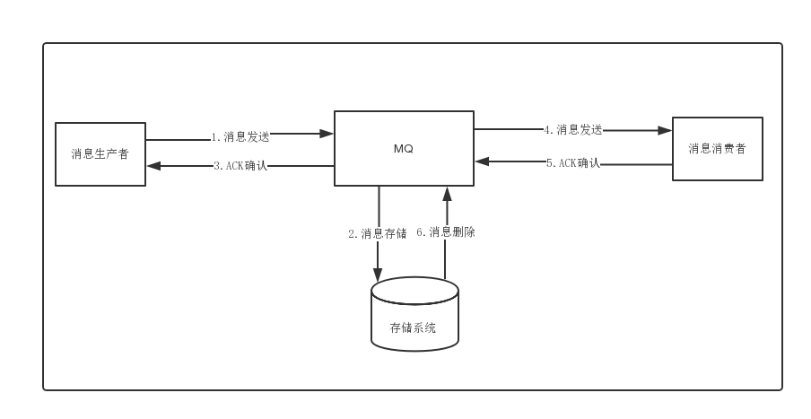

1. 消息生成者发送消息
2. MQ收到消息，将消息进行持久化，在存储中新增一条记录
3. 返回ACK给生产者
4. MQ push 消息给对应的消费者，然后等待消费者返回ACK
5. 如果消息消费者在指定时间内成功返回ack，那么MQ认为消息消费成功，在存储中删除消息，即执行第6步；如果MQ在指定时间内没有收到ACK，则认为消息消费失败，会尝试重新push消息,重复执行4、5、6步骤
6. MQ删除消息

### 1.1.1 存储介质

* 关系型数据库DB

Apache下开源的另外一款MQ—ActiveMQ（默认采用的KahaDB做消息存储）可选用JDBC的方式来做消息持久化，通过简单的xml配置信息即可实现JDBC消息存储。由于，普通关系型数据库（如Mysql）在单表数据量达到千万级别的情况下，其IO读写性能往往会出现瓶颈。在可靠性方面，该种方案非常依赖DB，如果一旦DB出现故障，则MQ的消息就无法落盘存储会导致线上故障


- 文件系统

  目前业界较为常用的几款产品（RocketMQ/Kafka/RabbitMQ）均采用的是消息刷盘至所部署虚拟机/物理机的文件系统来做持久化（刷盘一般可以分为异步刷盘和同步刷盘两种模式）。消息刷盘为消息存储提供了一种高效率、高可靠性和高性能的数据持久化方式。除非部署MQ机器本身或是本地磁盘挂了，否则一般是不会出现无法持久化的故障问题。

  


###1.1.2 性能对比

文件系统>关系型数据库DB

### 1.1.3 消息的存储和发送

#### 1）消息存储

磁盘如果使用得当，磁盘的速度完全可以匹配上网络 的数据传输速度。目前的高性能磁盘，顺序写速度可以达到600MB/s， 超过了一般网卡的传输速度。但是磁盘随机写的速度只有大概100KB/s，和顺序写的性能相差6000倍！因为有如此巨大的速度差别，好的消息队列系统会比普通的消息队列系统速度快多个数量级。RocketMQ的消息用顺序写,保证了消息存储的速度。

####2）消息发送

Linux操作系统分为【用户态】和【内核态】，文件操作、网络操作需要涉及这两种形态的切换，免不了进行数据复制。

一台服务器 把本机磁盘文件的内容发送到客户端，一般分为两个步骤：

1）read；读取本地文件内容； 

2）write；将读取的内容通过网络发送出去。

这两个看似简单的操作，实际进行了4 次数据复制，分别是：

1. 从磁盘复制数据到内核态内存；
2. 从内核态内存复 制到用户态内存；
3. 然后从用户态 内存复制到网络驱动的内核态内存；
4. 最后是从网络驱动的内核态内存复 制到网卡中进行传输。

通过使用mmap的方式，可以省去向用户态的内存复制，提高速度。这种机制在Java中是通过MappedByteBuffer实现的

RocketMQ充分利用了上述特性，也就是所谓的“零拷贝”技术，提高消息存盘和网络发送的速度。

> 这里需要注意的是，采用MappedByteBuffer这种内存映射的方式有几个限制，其中之一是一次只能映射1.5~2G 的文件至用户态的虚拟内存，这也是为何RocketMQ默认设置单个CommitLog日志数据文件为1G的原因了

### 1.1.4 消息存储结构

RocketMQ消息的存储是由ConsumeQueue和CommitLog配合完成 的，消息真正的物理存储文件是CommitLog，ConsumeQueue是消息的逻辑队列，类似数据库的索引文件，存储的是指向物理存储的地址。每 个Topic下的每个Message Queue都有一个对应的ConsumeQueue文件。


* CommitLog：存储消息的元数据
* ConsumerQueue：存储消息在CommitLog的索引
* IndexFile：为了消息查询提供了一种通过key或时间区间来查询消息的方法，这种通过IndexFile来查找消息的方法不影响发送与消费消息的主流程

### 1.1.5 刷盘机制

RocketMQ的消息是存储到磁盘上的，这样既能保证断电后恢复， 又可以让存储的消息量超出内存的限制。RocketMQ为了提高性能，会尽可能地保证磁盘的顺序写。消息在通过Producer写入RocketMQ的时 候，有两种写磁盘方式，分布式同步刷盘和异步刷盘。


#### 1）同步刷盘

在返回写成功状态时，消息已经被写入磁盘。具体流程是，消息写入内存的PAGECACHE后，立刻通知刷盘线程刷盘， 然后等待刷盘完成，刷盘线程执行完成后唤醒等待的线程，返回消息写 成功的状态。

#### 2）异步刷盘

在返回写成功状态时，消息可能只是被写入了内存的PAGECACHE，写操作的返回快，吞吐量大；当内存里的消息量积累到一定程度时，统一触发写磁盘动作，快速写入。

####3）配置

**同步刷盘还是异步刷盘，都是通过Broker配置文件里的flushDiskType 参数设置的，这个参数被配置成SYNC_FLUSH、ASYNC_FLUSH中的 一个。**

## 1.2 高可用性机制


RocketMQ分布式集群是通过Master和Slave的配合达到高可用性的。

Master和Slave的区别：在Broker的配置文件中，参数 brokerId的值为0表明这个Broker是Master，大于0表明这个Broker是 Slave，同时brokerRole参数也会说明这个Broker是Master还是Slave。

Master角色的Broker支持读和写，Slave角色的Broker仅支持读，也就是 Producer只能和Master角色的Broker连接写入消息；Consumer可以连接 Master角色的Broker，也可以连接Slave角色的Broker来读取消息。

### 1.2.1 消息消费高可用

在Consumer的配置文件中，并不需要设置是从Master读还是从Slave 读，当Master不可用或者繁忙的时候，Consumer会被自动切换到从Slave 读。有了自动切换Consumer这种机制，当一个Master角色的机器出现故障后，Consumer仍然可以从Slave读取消息，不影响Consumer程序。这就达到了消费端的高可用性。

### 1.2.2 消息发送高可用

在创建Topic的时候，把Topic的多个Message Queue创建在多个Broker组上（相同Broker名称，不同 brokerId的机器组成一个Broker组），这样当一个Broker组的Master不可 用后，其他组的Master仍然可用，Producer仍然可以发送消息。 RocketMQ目前还不支持把Slave自动转成Master，如果机器资源不足， 需要把Slave转成Master，则要手动停止Slave角色的Broker，更改配置文 件，用新的配置文件启动Broker。


### 1.2.3 消息主从复制

如果一个Broker组有Master和Slave，消息需要从Master复制到Slave 上，有同步和异步两种复制方式。

####1）同步复制

同步复制方式是等Master和Slave均写 成功后才反馈给客户端写成功状态；

在同步复制方式下，如果Master出故障， Slave上有全部的备份数据，容易恢复，但是同步复制会增大数据写入 延迟，降低系统吞吐量。

####2）异步复制 

异步复制方式是只要Master写成功 即可反馈给客户端写成功状态。

在异步复制方式下，系统拥有较低的延迟和较高的吞吐量，但是如果Master出了故障，有些数据因为没有被写 入Slave，有可能会丢失；

####3）配置

同步复制和异步复制是通过Broker配置文件里的brokerRole参数进行设置的，这个参数可以被设置成ASYNC_MASTER、 SYNC_MASTER、SLAVE三个值中的一个。

####4）总结


实际应用中要结合业务场景，合理设置刷盘方式和主从复制方式， 尤其是SYNC_FLUSH方式，由于频繁地触发磁盘写动作，会明显降低 性能。通常情况下，应该把Master和Save配置成ASYNC_FLUSH的刷盘 方式，主从之间配置成SYNC_MASTER的复制方式，这样即使有一台 机器出故障，仍然能保证数据不丢，是个不错的选择。

## 1.3 负载均衡

### 1.3.1 Producer负载均衡

Producer端，每个实例在发消息的时候，默认会轮询所有的message queue发送，以达到让消息平均落在不同的queue上。而由于queue可以散落在不同的broker，所以消息就发送到不同的broker下，如下图：


图中箭头线条上的标号代表顺序，发布方会把第一条消息发送至 Queue 0，然后第二条消息发送至 Queue 1，以此类推。

### 1.3.2 Consumer负载均衡

#### 1）集群模式

在集群消费模式下，每条消息只需要投递到订阅这个topic的Consumer Group下的一个实例即可。RocketMQ采用主动拉取的方式拉取并消费消息，在拉取的时候需要明确指定拉取哪一条message queue。

而每当实例的数量有变更，都会触发一次所有实例的负载均衡，这时候会按照queue的数量和实例的数量平均分配queue给每个实例。

默认的分配算法是AllocateMessageQueueAveragely，如下图：


还有另外一种平均的算法是AllocateMessageQueueAveragelyByCircle，也是平均分摊每一条queue，只是以环状轮流分queue的形式，如下图：


需要注意的是，集群模式下，queue都是只允许分配只一个实例，这是由于如果多个实例同时消费一个queue的消息，由于拉取哪些消息是consumer主动控制的，那样会导致同一个消息在不同的实例下被消费多次，所以算法上都是一个queue只分给一个consumer实例，一个consumer实例可以允许同时分到不同的queue。

通过增加consumer实例去分摊queue的消费，可以起到水平扩展的消费能力的作用。而有实例下线的时候，会重新触发负载均衡，这时候原来分配到的queue将分配到其他实例上继续消费。

但是如果consumer实例的数量比message queue的总数量还多的话，多出来的consumer实例将无法分到queue，也就无法消费到消息，也就无法起到分摊负载的作用了。所以需要控制让queue的总数量大于等于consumer的数量。

####2）广播模式

由于广播模式下要求一条消息需要投递到一个消费组下面所有的消费者实例，所以也就没有消息被分摊消费的说法。

在实现上，其中一个不同就是在consumer分配queue的时候，所有consumer都分到所有的queue。

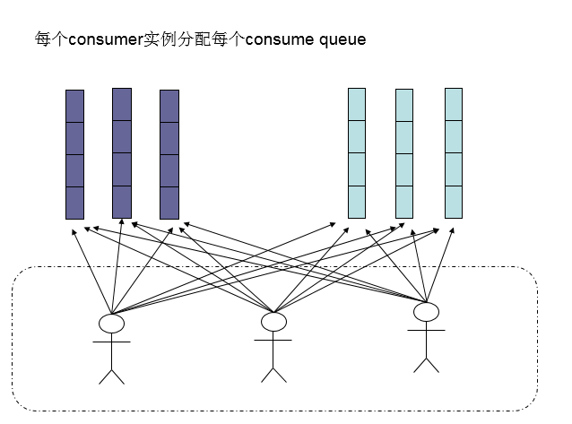

## 1.4 消息重试

### 1.4.1 顺序消息的重试

对于顺序消息，当消费者消费消息失败后，消息队列 RocketMQ 会自动不断进行消息重试（每次间隔时间为 1 秒），这时，应用会出现消息消费被阻塞的情况。因此，在使用顺序消息时，务必保证应用能够及时监控并处理消费失败的情况，避免阻塞现象的发生。

### 1.4.2 无序消息的重试

对于无序消息（普通、定时、延时、事务消息），当消费者消费消息失败时，您可以通过设置返回状态达到消息重试的结果。

无序消息的重试只针对集群消费方式生效；广播方式不提供失败重试特性，即消费失败后，失败消息不再重试，继续消费新的消息。

#### 1）重试次数

消息队列 RocketMQ 默认允许每条消息最多重试 16 次，每次重试的间隔时间如下：

| 第几次重试 | 与上次重试的间隔时间 | 第几次重试 | 与上次重试的间隔时间 |
| :--------: | :------------------: | :--------: | :------------------: |
|     1      |        10 秒         |     9      |        7 分钟        |
|     2      |        30 秒         |     10     |        8 分钟        |
|     3      |        1 分钟        |     11     |        9 分钟        |
|     4      |        2 分钟        |     12     |       10 分钟        |
|     5      |        3 分钟        |     13     |       20 分钟        |
|     6      |        4 分钟        |     14     |       30 分钟        |
|     7      |        5 分钟        |     15     |        1 小时        |
|     8      |        6 分钟        |     16     |        2 小时        |

如果消息重试 16 次后仍然失败，消息将不再投递。如果严格按照上述重试时间间隔计算，某条消息在一直消费失败的前提下，将会在接下来的 4 小时 46 分钟之内进行 16 次重试，超过这个时间范围消息将不再重试投递。

**注意：** 一条消息无论重试多少次，这些重试消息的 Message ID 不会改变。

#### 2）配置方式

**消费失败后，重试配置方式**

集群消费方式下，消息消费失败后期望消息重试，需要在消息监听器接口的实现中明确进行配置（三种方式任选一种）：

- 返回 Action.ReconsumeLater （推荐）
- 返回 Null
- 抛出异常

```java
public class MessageListenerImpl implements MessageListener {
    @Override
    public Action consume(Message message, ConsumeContext context) {
        //处理消息
        doConsumeMessage(message);
        //方式1：返回 Action.ReconsumeLater，消息将重试
        return Action.ReconsumeLater;
        //方式2：返回 null，消息将重试
        return null;
        //方式3：直接抛出异常， 消息将重试
        throw new RuntimeException("Consumer Message exceotion");
    }
}
```

**消费失败后，不重试配置方式**

集群消费方式下，消息失败后期望消息不重试，需要捕获消费逻辑中可能抛出的异常，最终返回 Action.CommitMessage，此后这条消息将不会再重试。

```java
public class MessageListenerImpl implements MessageListener {
    @Override
    public Action consume(Message message, ConsumeContext context) {
        try {
            doConsumeMessage(message);
        } catch (Throwable e) {
            //捕获消费逻辑中的所有异常，并返回 Action.CommitMessage;
            return Action.CommitMessage;
        }
        //消息处理正常，直接返回 Action.CommitMessage;
        return Action.CommitMessage;
    }
}
```

**自定义消息最大重试次数**

消息队列 RocketMQ 允许 Consumer 启动的时候设置最大重试次数，重试时间间隔将按照如下策略：

- 最大重试次数小于等于 16 次，则重试时间间隔同上表描述。
- 最大重试次数大于 16 次，超过 16 次的重试时间间隔均为每次 2 小时。

```java
Properties properties = new Properties();
//配置对应 Group ID 的最大消息重试次数为 20 次
properties.put(PropertyKeyConst.MaxReconsumeTimes,"20");
Consumer consumer =ONSFactory.createConsumer(properties);
```

> 注意：

- 消息最大重试次数的设置对相同 Group ID 下的所有 Consumer 实例有效。
- 如果只对相同 Group ID 下两个 Consumer 实例中的其中一个设置了 MaxReconsumeTimes，那么该配置对两个 Consumer 实例均生效。
- 配置采用覆盖的方式生效，即最后启动的 Consumer 实例会覆盖之前的启动实例的配置

**获取消息重试次数**

消费者收到消息后，可按照如下方式获取消息的重试次数：

```java
public class MessageListenerImpl implements MessageListener {
    @Override
    public Action consume(Message message, ConsumeContext context) {
        //获取消息的重试次数
        System.out.println(message.getReconsumeTimes());
        return Action.CommitMessage;
    }
}
```

## 1.5 死信队列

当一条消息初次消费失败，消息队列 RocketMQ 会自动进行消息重试；达到最大重试次数后，若消费依然失败，则表明消费者在正常情况下无法正确地消费该消息，此时，消息队列 RocketMQ 不会立刻将消息丢弃，而是将其发送到该消费者对应的特殊队列中。

在消息队列 RocketMQ 中，这种正常情况下无法被消费的消息称为死信消息（Dead-Letter Message），存储死信消息的特殊队列称为死信队列（Dead-Letter Queue）。

### 1.5.1 死信特性

死信消息具有以下特性

- 不会再被消费者正常消费。
- 有效期与正常消息相同，均为 3 天，3 天后会被自动删除。因此，请在死信消息产生后的 3 天内及时处理。

死信队列具有以下特性：

- 一个死信队列对应一个 Group ID， 而不是对应单个消费者实例。
- 如果一个 Group ID 未产生死信消息，消息队列 RocketMQ 不会为其创建相应的死信队列。
- 一个死信队列包含了对应 Group ID 产生的所有死信消息，不论该消息属于哪个 Topic。

### 1.5.2 查看死信信息

1. 在控制台查询出现死信队列的主题信息


2. 在消息界面根据主题查询死信消息


3. 选择重新发送消息

一条消息进入死信队列，意味着某些因素导致消费者无法正常消费该消息，因此，通常需要您对其进行特殊处理。排查可疑因素并解决问题后，可以在消息队列 RocketMQ 控制台重新发送该消息，让消费者重新消费一次。

## 1.6 消费幂等

消息队列 RocketMQ 消费者在接收到消息以后，有必要根据业务上的唯一 Key 对消息做幂等处理的必要性。

### 1.6.1 消费幂等的必要性

在互联网应用中，尤其在网络不稳定的情况下，消息队列 RocketMQ 的消息有可能会出现重复，这个重复简单可以概括为以下情况：

- 发送时消息重复

  当一条消息已被成功发送到服务端并完成持久化，此时出现了网络闪断或者客户端宕机，导致服务端对客户端应答失败。 如果此时生产者意识到消息发送失败并尝试再次发送消息，消费者后续会收到两条内容相同并且 Message ID 也相同的消息。

- 投递时消息重复

  消息消费的场景下，消息已投递到消费者并完成业务处理，当客户端给服务端反馈应答的时候网络闪断。 为了保证消息至少被消费一次，消息队列 RocketMQ 的服务端将在网络恢复后再次尝试投递之前已被处理过的消息，消费者后续会收到两条内容相同并且 Message ID 也相同的消息。

- 负载均衡时消息重复（包括但不限于网络抖动、Broker 重启以及订阅方应用重启）

  当消息队列 RocketMQ 的 Broker 或客户端重启、扩容或缩容时，会触发 Rebalance，此时消费者可能会收到重复消息。

### 1.6.2 处理方式

因为 Message ID 有可能出现冲突（重复）的情况，所以真正安全的幂等处理，不建议以 Message ID 作为处理依据。 最好的方式是以业务唯一标识作为幂等处理的关键依据，而业务的唯一标识可以通过消息 Key 进行设置：

```java
Message message = new Message();
message.setKey("ORDERID_100");
SendResult sendResult = producer.send(message);
```

订阅方收到消息时可以根据消息的 Key 进行幂等处理：

```java
consumer.subscribe("ons_test", "*", new MessageListener() {
    public Action consume(Message message, ConsumeContext context) {
        String key = message.getKey()
        // 根据业务唯一标识的 key 做幂等处理
    }
});
```

# 2. 源码分析

## 2.1 环境搭建

依赖工具

- JDK ：1.8+
- Maven
- IntelliJ IDEA

### 2.1.1 源码拉取

从官方仓库 <https://github.com/apache/rocketmq> `clone`或者`download`源码。

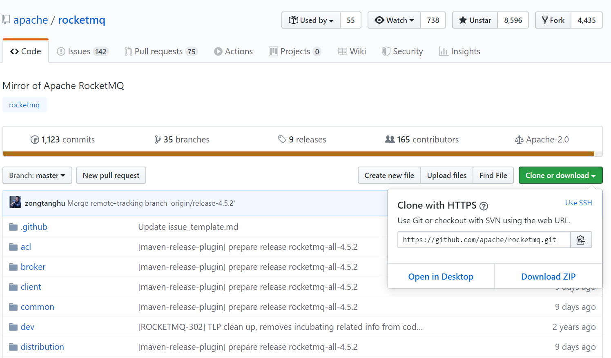

**源码目录结构：**

* broker: broker 模块（broke 启动进程） 

* client ：消息客户端，包含消息生产者、消息消费者相关类 
* common ：公共包 
* dev ：开发者信息（非源代码） 
* distribution ：部署实例文件夹（非源代码） 
* example: RocketMQ 例代码 
* filter ：消息过滤相关基础类

* filtersrv：消息过滤服务器实现相关类（Filter启动进程）
* logappender：日志实现相关类
* namesrv：NameServer实现相关类（NameServer启动进程）
* openmessageing：消息开放标准
* remoting：远程通信模块，给予Netty
* srcutil：服务工具类
* store：消息存储实现相关类
* style：checkstyle相关实现
* test：测试相关类
* tools：工具类，监控命令相关实现类

###2.1.2 导入IDEA


**执行安装**

```sh
clean install -Dmaven.test.skip=true
```

### 2.1.3 调试

创建`conf`配置文件夹,从`distribution`拷贝`broker.conf`和`logback_broker.xml`和`logback_namesrv.xml`

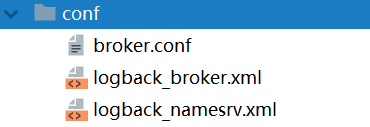

#### 1）启动NameServer

* 展开namesrv模块，右键NamesrvStartup.java


* 配置**ROCKETMQ_HOME**

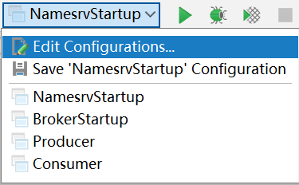

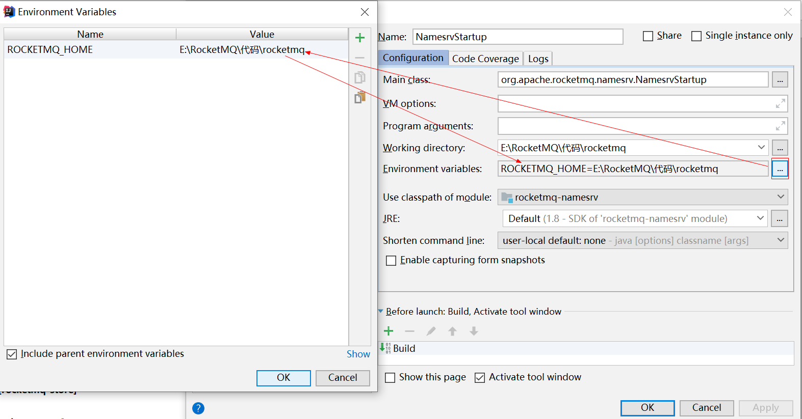

* 重新启动

  控制台打印结果

```sh
The Name Server boot success. serializeType=JSON
```

#### 2）启动Broker

* `broker.conf`配置文件内容

```properties
brokerClusterName = DefaultCluster
brokerName = broker-a
brokerId = 0
# namesrvAddr地址
namesrvAddr=127.0.0.1:9876
deleteWhen = 04
fileReservedTime = 48
brokerRole = ASYNC_MASTER
flushDiskType = ASYNC_FLUSH
autoCreateTopicEnable=true

# 存储路径
storePathRootDir=E:\\RocketMQ\\data\\rocketmq\\dataDir
# commitLog路径
storePathCommitLog=E:\\RocketMQ\\data\\rocketmq\\dataDir\\commitlog
# 消息队列存储路径
storePathConsumeQueue=E:\\RocketMQ\\data\\rocketmq\\dataDir\\consumequeue
# 消息索引存储路径
storePathIndex=E:\\RocketMQ\\data\\rocketmq\\dataDir\\index
# checkpoint文件路径
storeCheckpoint=E:\\RocketMQ\\data\\rocketmq\\dataDir\\checkpoint
# abort文件存储路径
abortFile=E:\\RocketMQ\\data\\rocketmq\\dataDir\\abort
```

* 创建数据文件夹`dataDir`
* 启动`BrokerStartup`,配置`broker.conf`和`ROCKETMQ_HOME`

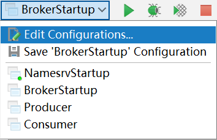


####3）发送消息

* 进入example模块的`org.apache.rocketmq.example.quickstart`
* 指定Namesrv地址

```java
DefaultMQProducer producer = new DefaultMQProducer("please_rename_unique_group_name");
producer.setNamesrvAddr("127.0.0.1:9876");
```

* 运行`main`方法，发送消息

#### 4）消费消息

* 进入example模块的`org.apache.rocketmq.example.quickstart`
* 指定Namesrv地址

```java
DefaultMQPushConsumer consumer = new DefaultMQPushConsumer("please_rename_unique_group_name_4");
consumer.setNamesrvAddr("127.0.0.1:9876");
```

* 运行`main`方法，消费消息

## 2.2 NameServer

### 2.2.1 架构设计

消息中间件的设计思路一般是基于主题订阅发布的机制，消息生产者（Producer）发送某一个主题到消息服务器，消息服务器负责将消息持久化存储，消息消费者（Consumer）订阅该兴趣的主题，消息服务器根据订阅信息（路由信息）将消息推送到消费者（Push模式）或者消费者主动向消息服务器拉去（Pull模式），从而实现消息生产者与消息消费者解耦。为了避免消息服务器的单点故障导致的整个系统瘫痪，通常会部署多台消息服务器共同承担消息的存储。那消息生产者如何知道消息要发送到哪台消息服务器呢？如果某一台消息服务器宕机了，那么消息生产者如何在不重启服务情况下感知呢？

NameServer就是为了解决以上问题设计的。


Broker消息服务器在启动的时向所有NameServer注册，消息生产者（Producer）在发送消息时之前先从NameServer获取Broker服务器地址列表，然后根据负载均衡算法从列表中选择一台服务器进行发送。NameServer与每台Broker保持长连接，并间隔30S检测Broker是否存活，如果检测到Broker宕机，则从路由注册表中删除。但是路由变化不会马上通知消息生产者。这样设计的目的是为了降低NameServer实现的复杂度，在消息发送端提供容错机制保证消息发送的可用性。

NameServer本身的高可用是通过部署多台NameServer来实现，但彼此之间不通讯，也就是NameServer服务器之间在某一个时刻的数据并不完全相同，但这对消息发送并不会造成任何影响，这也是NameServer设计的一个亮点，总之，RocketMQ设计追求简单高效。

### 2.2.2 启动流程

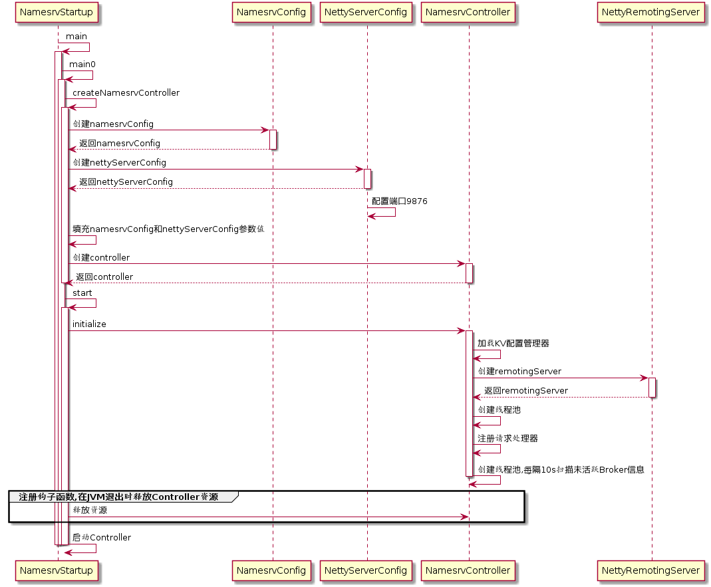

启动类：`org.apache.rocketmq.namesrv.NamesrvStartup`

####步骤一

解析配置文件，填充NameServerConfig、NettyServerConfig属性值，并创建NamesrvController

***代码：NamesrvController#createNamesrvController***

```java
//创建NamesrvConfig
final NamesrvConfig namesrvConfig = new NamesrvConfig();
//创建NettyServerConfig
final NettyServerConfig nettyServerConfig = new NettyServerConfig();
//设置启动端口号
nettyServerConfig.setListenPort(9876);
//解析启动-c参数
if (commandLine.hasOption('c')) {
    String file = commandLine.getOptionValue('c');
    if (file != null) {
        InputStream in = new BufferedInputStream(new FileInputStream(file));
        properties = new Properties();
        properties.load(in);
        MixAll.properties2Object(properties, namesrvConfig);
        MixAll.properties2Object(properties, nettyServerConfig);

        namesrvConfig.setConfigStorePath(file);

        System.out.printf("load config properties file OK, %s%n", file);
        in.close();
    }
}
//解析启动-p参数
if (commandLine.hasOption('p')) {
    InternalLogger console = InternalLoggerFactory.getLogger(LoggerName.NAMESRV_CONSOLE_NAME);
    MixAll.printObjectProperties(console, namesrvConfig);
    MixAll.printObjectProperties(console, nettyServerConfig);
    System.exit(0);
}
//将启动参数填充到namesrvConfig,nettyServerConfig
MixAll.properties2Object(ServerUtil.commandLine2Properties(commandLine), namesrvConfig);

//创建NameServerController
final NamesrvController controller = new NamesrvController(namesrvConfig, nettyServerConfig);
```

<u>**NamesrvConfig属性**</u>

```java
private String rocketmqHome = System.getProperty(MixAll.ROCKETMQ_HOME_PROPERTY, System.getenv(MixAll.ROCKETMQ_HOME_ENV));
private String kvConfigPath = System.getProperty("user.home") + File.separator + "namesrv" + File.separator + "kvConfig.json";
private String configStorePath = System.getProperty("user.home") + File.separator + "namesrv" + File.separator + "namesrv.properties";
private String productEnvName = "center";
private boolean clusterTest = false;
private boolean orderMessageEnable = false;
```

**rocketmqHome：**rocketmq主目录

**kvConfig：**NameServer存储KV配置属性的持久化路径

**configStorePath：**nameServer默认配置文件路径

**orderMessageEnable：**是否支持顺序消息

<u>**NettyServerConfig属性**</u>

```java
private int listenPort = 8888;
private int serverWorkerThreads = 8;
private int serverCallbackExecutorThreads = 0;
private int serverSelectorThreads = 3;
private int serverOnewaySemaphoreValue = 256;
private int serverAsyncSemaphoreValue = 64;
private int serverChannelMaxIdleTimeSeconds = 120;
private int serverSocketSndBufSize = NettySystemConfig.socketSndbufSize;
private int serverSocketRcvBufSize = NettySystemConfig.socketRcvbufSize;
private boolean serverPooledByteBufAllocatorEnable = true;
private boolean useEpollNativeSelector = false;
```

**listenPort：**NameServer监听端口，该值默认会被初始化为9876
**serverWorkerThreads：**Netty业务线程池线程个数
**serverCallbackExecutorThreads：**Netty public任务线程池线程个数，Netty网络设计，根据业务类型会创建不同的线程池，比如处理消息发送、消息消费、心跳检测等。如果该业务类型未注册线程池，则由public线程池执行。
**serverSelectorThreads：**IO线程池个数，主要是NameServer、Broker端解析请求、返回相应的线程个数，这类线程主要是处理网路请求的，解析请求包，然后转发到各个业务线程池完成具体的操作，然后将结果返回给调用方;
**serverOnewaySemaphoreValue：**send oneway消息请求并发读（Broker端参数）;
**serverAsyncSemaphoreValue：**异步消息发送最大并发度;
**serverChannelMaxIdleTimeSeconds ：**网络连接最大的空闲时间，默认120s。
**serverSocketSndBufSize：**网络socket发送缓冲区大小。
**serverSocketRcvBufSize：** 网络接收端缓存区大小。
**serverPooledByteBufAllocatorEnable：**ByteBuffer是否开启缓存;
**useEpollNativeSelector：**是否启用Epoll IO模型。

#### 步骤二

根据启动属性创建NamesrvController实例，并初始化该实例。NameServerController实例为NameServer核心控制器

***代码：NamesrvController#initialize***

```java
public boolean initialize() {
	//加载KV配置
    this.kvConfigManager.load();
	//创建NettyServer网络处理对象
    this.remotingServer = new NettyRemotingServer(this.nettyServerConfig, this.brokerHousekeepingService);
	//开启定时任务:每隔10s扫描一次Broker,移除不活跃的Broker
    this.remotingExecutor =
        Executors.newFixedThreadPool(nettyServerConfig.getServerWorkerThreads(), new ThreadFactoryImpl("RemotingExecutorThread_"));
    this.registerProcessor();
    this.scheduledExecutorService.scheduleAtFixedRate(new Runnable() {
        @Override
        public void run() {
            NamesrvController.this.routeInfoManager.scanNotActiveBroker();
        }
    }, 5, 10, TimeUnit.SECONDS);
	//开启定时任务:每隔10min打印一次KV配置
	this.scheduledExecutorService.scheduleAtFixedRate(new Runnable() {

        @Override
        public void run() {
            NamesrvController.this.kvConfigManager.printAllPeriodically();
        }
    }, 1, 10, TimeUnit.MINUTES);
    return true;
}
```

#### 步骤三

在JVM进程关闭之前，先将线程池关闭，及时释放资源

***代码：NamesrvStartup#start***

```java
//注册JVM钩子函数代码
Runtime.getRuntime().addShutdownHook(new ShutdownHookThread(log, new Callable<Void>() {
    @Override
    public Void call() throws Exception {
        //释放资源
        controller.shutdown();
        return null;
    }
}));
```

### 2.2.3 路由管理

NameServer的主要作用是为消息的生产者和消息消费者提供关于主题Topic的路由信息，那么NameServer需要存储路由的基础信息，还要管理Broker节点，包括路由注册、路由删除等。

#### 2.2.3.1 路由元信息

***代码：RouteInfoManager***

```java
private final HashMap<String/* topic */, List<QueueData>> topicQueueTable;
private final HashMap<String/* brokerName */, BrokerData> brokerAddrTable;
private final HashMap<String/* clusterName */, Set<String/* brokerName */>> clusterAddrTable;
private final HashMap<String/* brokerAddr */, BrokerLiveInfo> brokerLiveTable;
private final HashMap<String/* brokerAddr */, List<String>/* Filter Server */> filterServerTable;
```

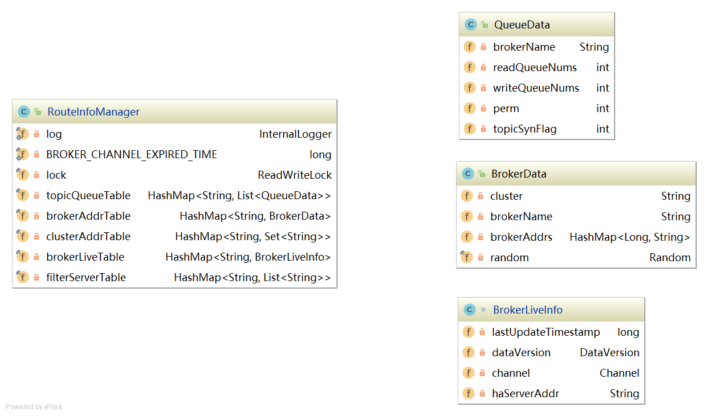

**topicQueueTable：**Topic消息队列路由信息，消息发送时根据路由表进行负载均衡

**brokerAddrTable：**Broker基础信息，包括brokerName、所属集群名称、主备Broker地址

**clusterAddrTable：**Broker集群信息，存储集群中所有Broker名称

**brokerLiveTable：**Broker状态信息，NameServer每次收到心跳包是会替换该信息

**filterServerTable：**Broker上的FilterServer列表，用于类模式消息过滤。

> RocketMQ基于定于发布机制，一个Topic拥有多个消息队列，一个Broker为每一个主题创建4个读队列和4个写队列。多个Broker组成一个集群，集群由相同的多台Broker组成Master-Slave架构，brokerId为0代表Master，大于0为Slave。BrokerLiveInfo中的lastUpdateTimestamp存储上次收到Broker心跳包的时间。


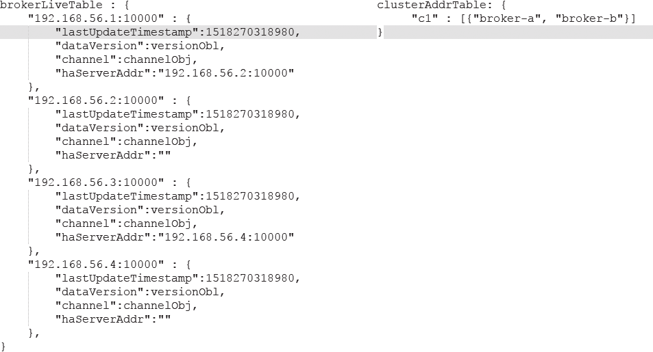

#### 2.2.3.2 路由注册

#####1）发送心跳包


RocketMQ路由注册是通过Broker与NameServer的心跳功能实现的。Broker启动时向集群中所有的NameServer发送心跳信息，每隔30s向集群中所有NameServer发送心跳包，NameServer收到心跳包时会更新brokerLiveTable缓存中BrokerLiveInfo的lastUpdataTimeStamp信息，然后NameServer每隔10s扫描brokerLiveTable，如果连续120S没有收到心跳包，NameServer将移除Broker的路由信息同时关闭Socket连接。

***代码：BrokerController#start***

```java
//注册Broker信息
this.registerBrokerAll(true, false, true);
//每隔30s上报Broker信息到NameServer
this.scheduledExecutorService.scheduleAtFixedRate(new Runnable() {

    @Override
    public void run() {
        try {
            BrokerController.this.registerBrokerAll(true, false, brokerConfig.isForceRegister());
        } catch (Throwable e) {
            log.error("registerBrokerAll Exception", e);
        }
    }
}, 1000 * 10, Math.max(10000, Math.min(brokerConfig.getRegisterNameServerPeriod(), 60000)), 
                                                  TimeUnit.MILLISECONDS);

```

***代码：BrokerOuterAPI#registerBrokerAll***

```java
//获得nameServer地址信息
List<String> nameServerAddressList = this.remotingClient.getNameServerAddressList();
//遍历所有nameserver列表
if (nameServerAddressList != null && nameServerAddressList.size() > 0) {

    //封装请求头
    final RegisterBrokerRequestHeader requestHeader = new RegisterBrokerRequestHeader();
    requestHeader.setBrokerAddr(brokerAddr);
    requestHeader.setBrokerId(brokerId);
    requestHeader.setBrokerName(brokerName);
    requestHeader.setClusterName(clusterName);
    requestHeader.setHaServerAddr(haServerAddr);
    requestHeader.setCompressed(compressed);
	//封装请求体
    RegisterBrokerBody requestBody = new RegisterBrokerBody();
    requestBody.setTopicConfigSerializeWrapper(topicConfigWrapper);
    requestBody.setFilterServerList(filterServerList);
    final byte[] body = requestBody.encode(compressed);
    final int bodyCrc32 = UtilAll.crc32(body);
    requestHeader.setBodyCrc32(bodyCrc32);
    final CountDownLatch countDownLatch = new CountDownLatch(nameServerAddressList.size());
    for (final String namesrvAddr : nameServerAddressList) {
        brokerOuterExecutor.execute(new Runnable() {
            @Override
            public void run() {
                try {
                    //分别向NameServer注册
                    RegisterBrokerResult result = registerBroker(namesrvAddr,oneway, timeoutMills,requestHeader,body);
                    if (result != null) {
                        registerBrokerResultList.add(result);
                    }

                    log.info("register broker[{}]to name server {} OK", brokerId, namesrvAddr);
                } catch (Exception e) {
                    log.warn("registerBroker Exception, {}", namesrvAddr, e);
                } finally {
                    countDownLatch.countDown();
                }
            }
        });
    }

    try {
        countDownLatch.await(timeoutMills, TimeUnit.MILLISECONDS);
    } catch (InterruptedException e) {
    }
}
```

***代码：BrokerOutAPI#registerBroker***

```java
if (oneway) {
    try {
        this.remotingClient.invokeOneway(namesrvAddr, request, timeoutMills);
    } catch (RemotingTooMuchRequestException e) {
        // Ignore
    }
    return null;
}
RemotingCommand response = this.remotingClient.invokeSync(namesrvAddr, request, timeoutMills);
```

##### 2）处理心跳包


`org.apache.rocketmq.namesrv.processor.DefaultRequestProcessor`网路处理类解析请求类型，如果请求类型是为***REGISTER_BROKER***，则将请求转发到`RouteInfoManager#regiesterBroker`

***代码：DefaultRequestProcessor#processRequest***

```java
//判断是注册Broker信息
case RequestCode.REGISTER_BROKER:
	Version brokerVersion = MQVersion.value2Version(request.getVersion());
	if (brokerVersion.ordinal() >= MQVersion.Version.V3_0_11.ordinal()) {
	    return this.registerBrokerWithFilterServer(ctx, request);
	} else {
        //注册Broker信息
	    return this.registerBroker(ctx, request);
	}
```

***代码：DefaultRequestProcessor#registerBroker***

```java
RegisterBrokerResult result = this.namesrvController.getRouteInfoManager().registerBroker(
    requestHeader.getClusterName(),
    requestHeader.getBrokerAddr(),
    requestHeader.getBrokerName(),
    requestHeader.getBrokerId(),
    requestHeader.getHaServerAddr(),
    topicConfigWrapper,
    null,
    ctx.channel()
);
```

***代码：RouteInfoManager#registerBroker***

维护路由信息

```java
//加锁
this.lock.writeLock().lockInterruptibly();
//维护clusterAddrTable
Set<String> brokerNames = this.clusterAddrTable.get(clusterName);
if (null == brokerNames) {
    brokerNames = new HashSet<String>();
    this.clusterAddrTable.put(clusterName, brokerNames);
}
brokerNames.add(brokerName);
```

```java
//维护brokerAddrTable
BrokerData brokerData = this.brokerAddrTable.get(brokerName);
//第一次注册,则创建brokerData
if (null == brokerData) {
    registerFirst = true;
    brokerData = new BrokerData(clusterName, brokerName, new HashMap<Long, String>());
    this.brokerAddrTable.put(brokerName, brokerData);
}
//非第一次注册,更新Broker
Map<Long, String> brokerAddrsMap = brokerData.getBrokerAddrs();
Iterator<Entry<Long, String>> it = brokerAddrsMap.entrySet().iterator();
while (it.hasNext()) {
    Entry<Long, String> item = it.next();
    if (null != brokerAddr && brokerAddr.equals(item.getValue()) && brokerId != item.getKey()) {
        it.remove();
    }
}
String oldAddr = brokerData.getBrokerAddrs().put(brokerId, brokerAddr);
registerFirst = registerFirst || (null == oldAddr);
```

```java
//维护topicQueueTable
if (null != topicConfigWrapper && MixAll.MASTER_ID == brokerId) {
    if (this.isBrokerTopicConfigChanged(brokerAddr, topicConfigWrapper.getDataVersion()) || 
        registerFirst) {
        ConcurrentMap<String, TopicConfig> tcTable = topicConfigWrapper.getTopicConfigTable();
        if (tcTable != null) {
            for (Map.Entry<String, TopicConfig> entry : tcTable.entrySet()) {
                this.createAndUpdateQueueData(brokerName, entry.getValue());
            }
        }
    }
}
```

***代码：RouteInfoManager#createAndUpdateQueueData***

```java
private void createAndUpdateQueueData(final String brokerName, final TopicConfig topicConfig) {
    //创建QueueData
	QueueData queueData = new QueueData();
	queueData.setBrokerName(brokerName);
	queueData.setWriteQueueNums(topicConfig.getWriteQueueNums());
	queueData.setReadQueueNums(topicConfig.getReadQueueNums());
	queueData.setPerm(topicConfig.getPerm());
	queueData.setTopicSynFlag(topicConfig.getTopicSysFlag());
	//获得topicQueueTable中队列集合
	List<QueueData> queueDataList = this.topicQueueTable.get(topicConfig.getTopicName());
    //topicQueueTable为空,则直接添加queueData到队列集合
	if (null == queueDataList) {
	    queueDataList = new LinkedList<QueueData>();
	    queueDataList.add(queueData);
	    this.topicQueueTable.put(topicConfig.getTopicName(), queueDataList);
	    log.info("new topic registered, {} {}", topicConfig.getTopicName(), queueData);
	} else {
        //判断是否是新的队列
	    boolean addNewOne = true;
	    Iterator<QueueData> it = queueDataList.iterator();
	    while (it.hasNext()) {
	        QueueData qd = it.next();
            //如果brokerName相同,代表不是新的队列
	        if (qd.getBrokerName().equals(brokerName)) {
	            if (qd.equals(queueData)) {
	                addNewOne = false;
	        } else {
	                    log.info("topic changed, {} OLD: {} NEW: {}", topicConfig.getTopicName(), qd,
	                        queueData);
	                    it.remove();
	                }
	            }
	        }
		//如果是新的队列,则添加队列到queueDataList
        if (addNewOne) {
            queueDataList.add(queueData);
        }
    }
}
```

```java
//维护brokerLiveTable
BrokerLiveInfo prevBrokerLiveInfo = this.brokerLiveTable.put(brokerAddr,new BrokerLiveInfo(
    System.currentTimeMillis(),
    topicConfigWrapper.getDataVersion(),
    channel,
    haServerAddr));
```

```java
//维护filterServerList
if (filterServerList != null) {
    if (filterServerList.isEmpty()) {
        this.filterServerTable.remove(brokerAddr);
    } else {
        this.filterServerTable.put(brokerAddr, filterServerList);
    }
}

if (MixAll.MASTER_ID != brokerId) {
    String masterAddr = brokerData.getBrokerAddrs().get(MixAll.MASTER_ID);
    if (masterAddr != null) {
        BrokerLiveInfo brokerLiveInfo = this.brokerLiveTable.get(masterAddr);
        if (brokerLiveInfo != null) {
            result.setHaServerAddr(brokerLiveInfo.getHaServerAddr());
            result.setMasterAddr(masterAddr);
        }
    }
}
```

#### 2.2.3.3 路由删除

```Broker```每隔30s向```NameServer```发送一个心跳包，心跳包包含`BrokerId`，`Broker`地址，`Broker`名称，`Broker`所属集群名称、`Broker`关联的`FilterServer`列表。但是如果`Broker`宕机，`NameServer`无法收到心跳包，此时`NameServer`如何来剔除这些失效的`Broker`呢？`NameServer`会每隔10s扫描`brokerLiveTable`状态表，如果`BrokerLive`的**lastUpdateTimestamp**的时间戳距当前时间超过120s，则认为`Broker`失效，移除该`Broker`，关闭与`Broker`连接，同时更新`topicQueueTable`、`brokerAddrTable`、`brokerLiveTable`、`filterServerTable`。

**RocketMQ有两个触发点来删除路由信息**：

* NameServer定期扫描brokerLiveTable检测上次心跳包与当前系统的时间差，如果时间超过120s，则需要移除broker。
* Broker在正常关闭的情况下，会执行unregisterBroker指令

这两种方式路由删除的方法都是一样的，就是从相关路由表中删除与该broker相关的信息。


***代码：NamesrvController#initialize***

```java
//每隔10s扫描一次为活跃Broker
this.scheduledExecutorService.scheduleAtFixedRate(new Runnable() {

    @Override
    public void run() {
        NamesrvController.this.routeInfoManager.scanNotActiveBroker();
    }
}, 5, 10, TimeUnit.SECONDS);
```

***代码：RouteInfoManager#scanNotActiveBroker***

```java
public void scanNotActiveBroker() {
    //获得brokerLiveTable
    Iterator<Entry<String, BrokerLiveInfo>> it = this.brokerLiveTable.entrySet().iterator();
    //遍历brokerLiveTable
    while (it.hasNext()) {
        Entry<String, BrokerLiveInfo> next = it.next();
        long last = next.getValue().getLastUpdateTimestamp();
        //如果收到心跳包的时间距当时时间是否超过120s
        if ((last + BROKER_CHANNEL_EXPIRED_TIME) < System.currentTimeMillis()) {
            //关闭连接
            RemotingUtil.closeChannel(next.getValue().getChannel());
            //移除broker
            it.remove();
            //维护路由表
            this.onChannelDestroy(next.getKey(), next.getValue().getChannel());
        }
    }
}
```

***代码：RouteInfoManager#onChannelDestroy***

```java
//申请写锁,根据brokerAddress从brokerLiveTable和filterServerTable移除
this.lock.writeLock().lockInterruptibly();
this.brokerLiveTable.remove(brokerAddrFound);
this.filterServerTable.remove(brokerAddrFound);
```

```java
//维护brokerAddrTable
String brokerNameFound = null;
boolean removeBrokerName = false;
Iterator<Entry<String, BrokerData>> itBrokerAddrTable =this.brokerAddrTable.entrySet().iterator();
//遍历brokerAddrTable
while (itBrokerAddrTable.hasNext() && (null == brokerNameFound)) {
    BrokerData brokerData = itBrokerAddrTable.next().getValue();
    //遍历broker地址
    Iterator<Entry<Long, String>> it = brokerData.getBrokerAddrs().entrySet().iterator();
    while (it.hasNext()) {
        Entry<Long, String> entry = it.next();
        Long brokerId = entry.getKey();
        String brokerAddr = entry.getValue();
        //根据broker地址移除brokerAddr
        if (brokerAddr.equals(brokerAddrFound)) {
            brokerNameFound = brokerData.getBrokerName();
            it.remove();
            log.info("remove brokerAddr[{}, {}] from brokerAddrTable, because channel destroyed",
                brokerId, brokerAddr);
            break;
        }
    }
	//如果当前主题只包含待移除的broker,则移除该topic
    if (brokerData.getBrokerAddrs().isEmpty()) {
        removeBrokerName = true;
        itBrokerAddrTable.remove();
        log.info("remove brokerName[{}] from brokerAddrTable, because channel destroyed",
            brokerData.getBrokerName());
    }
}
```

```java
//维护clusterAddrTable
if (brokerNameFound != null && removeBrokerName) {
    Iterator<Entry<String, Set<String>>> it = this.clusterAddrTable.entrySet().iterator();
    //遍历clusterAddrTable
    while (it.hasNext()) {
        Entry<String, Set<String>> entry = it.next();
        //获得集群名称
        String clusterName = entry.getKey();
        //获得集群中brokerName集合
        Set<String> brokerNames = entry.getValue();
        //从brokerNames中移除brokerNameFound
        boolean removed = brokerNames.remove(brokerNameFound);
        if (removed) {
            log.info("remove brokerName[{}], clusterName[{}] from clusterAddrTable, because channel destroyed",
                brokerNameFound, clusterName);

            if (brokerNames.isEmpty()) {
                log.info("remove the clusterName[{}] from clusterAddrTable, because channel destroyed and no broker in this cluster",
                    clusterName);
                //如果集群中不包含任何broker,则移除该集群
                it.remove();
            }

            break;
        }
    }
}
```

```java
//维护topicQueueTable队列
if (removeBrokerName) {
    //遍历topicQueueTable
    Iterator<Entry<String, List<QueueData>>> itTopicQueueTable =
        this.topicQueueTable.entrySet().iterator();
    while (itTopicQueueTable.hasNext()) {
        Entry<String, List<QueueData>> entry = itTopicQueueTable.next();
        //主题名称
        String topic = entry.getKey();
        //队列集合
        List<QueueData> queueDataList = entry.getValue();
		//遍历该主题队列
        Iterator<QueueData> itQueueData = queueDataList.iterator();
        while (itQueueData.hasNext()) {
            //从队列中移除为活跃broker信息
            QueueData queueData = itQueueData.next();
            if (queueData.getBrokerName().equals(brokerNameFound)) {
                itQueueData.remove();
                log.info("remove topic[{} {}], from topicQueueTable, because channel destroyed",
                    topic, queueData);
            }
        }
		//如果该topic的队列为空,则移除该topic
        if (queueDataList.isEmpty()) {
            itTopicQueueTable.remove();
            log.info("remove topic[{}] all queue, from topicQueueTable, because channel destroyed",
                topic);
        }
    }
}
```

```java
//释放写锁
finally {
    this.lock.writeLock().unlock();
}
```

#### 2.2.3.4 路由发现

RocketMQ路由发现是非实时的，当Topic路由出现变化后，NameServer不会主动推送给客户端，而是由客户端定时拉取主题最新的路由。

***代码：DefaultRequestProcessor#getRouteInfoByTopic***

```java
public RemotingCommand getRouteInfoByTopic(ChannelHandlerContext ctx,
    RemotingCommand request) throws RemotingCommandException {
    final RemotingCommand response = RemotingCommand.createResponseCommand(null);
    final GetRouteInfoRequestHeader requestHeader =
        (GetRouteInfoRequestHeader) request.decodeCommandCustomHeader(GetRouteInfoRequestHeader.class);
	//调用RouteInfoManager的方法,从路由表topicQueueTable、brokerAddrTable、filterServerTable中分别填充TopicRouteData的List<QueueData>、List<BrokerData>、filterServer
    TopicRouteData topicRouteData = this.namesrvController.getRouteInfoManager().pickupTopicRouteData(requestHeader.getTopic());
	//如果找到主题对应你的路由信息并且该主题为顺序消息，则从NameServer KVConfig中获取关于顺序消息相关的配置填充路由信息
    if (topicRouteData != null) {
        if (this.namesrvController.getNamesrvConfig().isOrderMessageEnable()) {
            String orderTopicConf =
                this.namesrvController.getKvConfigManager().getKVConfig(NamesrvUtil.NAMESPACE_ORDER_TOPIC_CONFIG,
                    requestHeader.getTopic());
            topicRouteData.setOrderTopicConf(orderTopicConf);
        }

        byte[] content = topicRouteData.encode();
        response.setBody(content);
        response.setCode(ResponseCode.SUCCESS);
        response.setRemark(null);
        return response;
    }

    response.setCode(ResponseCode.TOPIC_NOT_EXIST);
    response.setRemark("No topic route info in name server for the topic: " + requestHeader.getTopic()
        + FAQUrl.suggestTodo(FAQUrl.APPLY_TOPIC_URL));
    return response;
}
```

### 2.2.4 小结


## 2.3 Producer

消息生产者的代码都在client模块中，相对于RocketMQ来讲，消息生产者就是客户端，也是消息的提供者。


###2.3.1 方法和属性

####1）主要方法介绍


* ```java
  //创建主题
  void createTopic(final String key, final String newTopic, final int queueNum) throws MQClientException;
  ```

* ```java
  //根据时间戳从队列中查找消息偏移量
  long searchOffset(final MessageQueue mq, final long timestamp)
  ```

* ```java
  //查找消息队列中最大的偏移量
  long maxOffset(final MessageQueue mq) throws MQClientException;
  ```

* ```java
  //查找消息队列中最小的偏移量
  long minOffset(final MessageQueue mq) 
  ```

* ```java
  //根据偏移量查找消息
  MessageExt viewMessage(final String offsetMsgId) throws RemotingException, MQBrokerException,
          InterruptedException, MQClientException;
  ```

* ```java
  //根据条件查找消息
  QueryResult queryMessage(final String topic, final String key, final int maxNum, final long begin,
          final long end) throws MQClientException, InterruptedException;
  ```

* ```java
  //根据消息ID和主题查找消息
  MessageExt viewMessage(String topic,String msgId) throws RemotingException, MQBrokerException, InterruptedException, MQClientException;
  ```


* ```java
  //启动
  void start() throws MQClientException;
  ```

* ```java
  //关闭
  void shutdown();
  ```

* ```java
  //查找该主题下所有消息
  List<MessageQueue> fetchPublishMessageQueues(final String topic) throws MQClientException;
  ```

* ```java
  //同步发送消息
  SendResult send(final Message msg) throws MQClientException, RemotingException, MQBrokerException,
          InterruptedException;
  ```

* ```java
  //同步超时发送消息
  SendResult send(final Message msg, final long timeout) throws MQClientException,
          RemotingException, MQBrokerException, InterruptedException;
  ```

* ```java
  //异步发送消息
  void send(final Message msg, final SendCallback sendCallback) throws MQClientException,
          RemotingException, InterruptedException;
  ```

* ```java
  //异步超时发送消息
  void send(final Message msg, final SendCallback sendCallback, final long timeout)
      throws MQClientException, RemotingException, InterruptedException;
  ```

* ```java
  //发送单向消息
  void sendOneway(final Message msg) throws MQClientException, RemotingException,
      InterruptedException;
  ```

* ```java
  //选择指定队列同步发送消息
  SendResult send(final Message msg, final MessageQueue mq) throws MQClientException,
      RemotingException, MQBrokerException, InterruptedException;
  ```

* ```java
  //选择指定队列异步发送消息
  void send(final Message msg, final MessageQueue mq, final SendCallback sendCallback)
      throws MQClientException, RemotingException, InterruptedException;
  ```

* ```java
  //选择指定队列单项发送消息
  void sendOneway(final Message msg, final MessageQueue mq) throws MQClientException,
      RemotingException, InterruptedException;
  ```

* ```java
  //批量发送消息
  SendResult send(final Collection<Message> msgs) throws MQClientException, RemotingException, MQBrokerException,InterruptedException;
  ```

####2）属性介绍

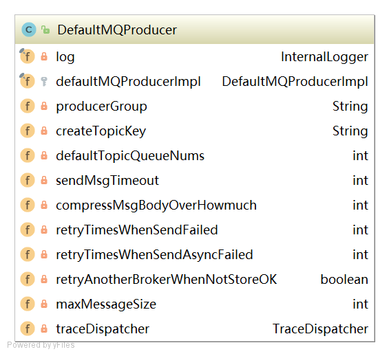

```java
producerGroup：生产者所属组
createTopicKey：默认Topic
defaultTopicQueueNums：默认主题在每一个Broker队列数量
sendMsgTimeout：发送消息默认超时时间，默认3s
compressMsgBodyOverHowmuch：消息体超过该值则启用压缩，默认4k
retryTimesWhenSendFailed：同步方式发送消息重试次数，默认为2，总共执行3次
retryTimesWhenSendAsyncFailed：异步方法发送消息重试次数，默认为2
retryAnotherBrokerWhenNotStoreOK：消息重试时选择另外一个Broker时，是否不等待存储结果就返回，默认为false
maxMessageSize：允许发送的最大消息长度，默认为4M
```

### 2.3.2 启动流程


***代码：DefaultMQProducerImpl#start***

```java
//检查生产者组是否满足要求
this.checkConfig();
//更改当前instanceName为进程ID
if (!this.defaultMQProducer.getProducerGroup().equals(MixAll.CLIENT_INNER_PRODUCER_GROUP)) {
    this.defaultMQProducer.changeInstanceNameToPID();
}
//获得MQ客户端实例
this.mQClientFactory = MQClientManager.getInstance().getAndCreateMQClientInstance(this.defaultMQProducer, rpcHook);
```

>整个JVM中只存在一个MQClientManager实例，维护一个MQClientInstance缓存表
>
>ConcurrentMap<String/* clientId */, MQClientInstance> factoryTable = new ConcurrentHashMap<String,MQClientInstance>();
>
>同一个clientId只会创建一个MQClientInstance。
>
>MQClientInstance封装了RocketMQ网络处理API，是消息生产者和消息消费者与NameServer、Broker打交道的网络通道

***代码：MQClientManager#getAndCreateMQClientInstance***

```java
public MQClientInstance getAndCreateMQClientInstance(final ClientConfig clientConfig, 
                                                     RPCHook rpcHook) {
    //构建客户端ID
    String clientId = clientConfig.buildMQClientId();
    //根据客户端ID或者客户端实例
    MQClientInstance instance = this.factoryTable.get(clientId);
    //实例如果为空就创建新的实例,并添加到实例表中
    if (null == instance) {
        instance =
            new MQClientInstance(clientConfig.cloneClientConfig(),
                this.factoryIndexGenerator.getAndIncrement(), clientId, rpcHook);
        MQClientInstance prev = this.factoryTable.putIfAbsent(clientId, instance);
        if (prev != null) {
            instance = prev;
            log.warn("Returned Previous MQClientInstance for clientId:[{}]", clientId);
        } else {
            log.info("Created new MQClientInstance for clientId:[{}]", clientId);
        }
    }

    return instance;
}
```

***代码：DefaultMQProducerImpl#start***

```java
//注册当前生产者到到MQClientInstance管理中,方便后续调用网路请求
boolean registerOK = mQClientFactory.registerProducer(this.defaultMQProducer.getProducerGroup(), this);
if (!registerOK) {
    this.serviceState = ServiceState.CREATE_JUST;
    throw new MQClientException("The producer group[" + this.defaultMQProducer.getProducerGroup()
        + "] has been created before, specify another name please." + FAQUrl.suggestTodo(FAQUrl.GROUP_NAME_DUPLICATE_URL),
        null);
}
//启动生产者
if (startFactory) {
    mQClientFactory.start();
}
```

### 2.3.3 消息发送

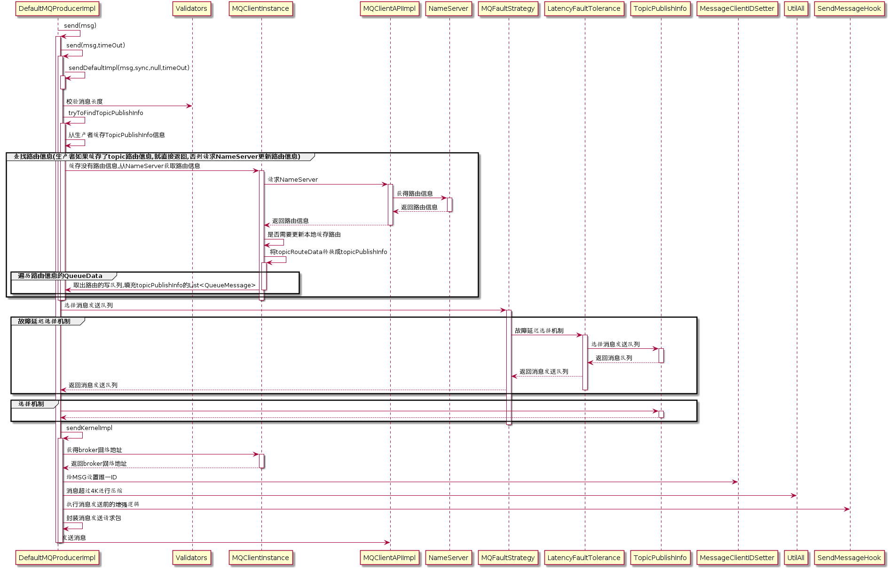

***代码：DefaultMQProducerImpl#send(Message msg)***

```java
//发送消息
public SendResult send(Message msg) {
    return send(msg, this.defaultMQProducer.getSendMsgTimeout());
}
```

***代码：DefaultMQProducerImpl#send(Message msg,long timeout)***

```java
//发送消息,默认超时时间为3s
public SendResult send(Message msg,long timeout){
    return this.sendDefaultImpl(msg, CommunicationMode.SYNC, null, timeout);
}
```

***代码：DefaultMQProducerImpl#sendDefaultImpl***

```java
//校验消息
Validators.checkMessage(msg, this.defaultMQProducer);
```

####1）验证消息

***代码：Validators#checkMessage***

```java
public static void checkMessage(Message msg, DefaultMQProducer defaultMQProducer)
    throws MQClientException {
    //判断是否为空
    if (null == msg) {
        throw new MQClientException(ResponseCode.MESSAGE_ILLEGAL, "the message is null");
    }
    // 校验主题
    Validators.checkTopic(msg.getTopic());
		
    // 校验消息体
    if (null == msg.getBody()) {
        throw new MQClientException(ResponseCode.MESSAGE_ILLEGAL, "the message body is null");
    }

    if (0 == msg.getBody().length) {
        throw new MQClientException(ResponseCode.MESSAGE_ILLEGAL, "the message body length is zero");
    }

    if (msg.getBody().length > defaultMQProducer.getMaxMessageSize()) {
        throw new MQClientException(ResponseCode.MESSAGE_ILLEGAL,
            "the message body size over max value, MAX: " + defaultMQProducer.getMaxMessageSize());
    }
}
```

####2）查找路由

***代码：DefaultMQProducerImpl#tryToFindTopicPublishInfo***

```java
private TopicPublishInfo tryToFindTopicPublishInfo(final String topic) {
    //从缓存中获得主题的路由信息
    TopicPublishInfo topicPublishInfo = this.topicPublishInfoTable.get(topic);
    //路由信息为空,则从NameServer获取路由
    if (null == topicPublishInfo || !topicPublishInfo.ok()) {
        this.topicPublishInfoTable.putIfAbsent(topic, new TopicPublishInfo());
        this.mQClientFactory.updateTopicRouteInfoFromNameServer(topic);
        topicPublishInfo = this.topicPublishInfoTable.get(topic);
    }

    if (topicPublishInfo.isHaveTopicRouterInfo() || topicPublishInfo.ok()) {
        return topicPublishInfo;
    } else {
        //如果未找到当前主题的路由信息,则用默认主题继续查找
        this.mQClientFactory.updateTopicRouteInfoFromNameServer(topic, true, this.defaultMQProducer);
        topicPublishInfo = this.topicPublishInfoTable.get(topic);
        return topicPublishInfo;
    }
}
```


***代码：TopicPublishInfo***

```java
public class TopicPublishInfo {
    private boolean orderTopic = false;	//是否是顺序消息
    private boolean haveTopicRouterInfo = false; 
    private List<MessageQueue> messageQueueList = new ArrayList<MessageQueue>();	//该主题消息队列
    private volatile ThreadLocalIndex sendWhichQueue = new ThreadLocalIndex();//每选择一次消息队列,该值+1
    private TopicRouteData topicRouteData;//关联Topic路由元信息
}
```

***代码：MQClientInstance#updateTopicRouteInfoFromNameServer***

```java
TopicRouteData topicRouteData;
//使用默认主题从NameServer获取路由信息
if (isDefault && defaultMQProducer != null) {
    topicRouteData = this.mQClientAPIImpl.getDefaultTopicRouteInfoFromNameServer(defaultMQProducer.getCreateTopicKey(),
        1000 * 3);
    if (topicRouteData != null) {
        for (QueueData data : topicRouteData.getQueueDatas()) {
            int queueNums = Math.min(defaultMQProducer.getDefaultTopicQueueNums(), data.getReadQueueNums());
            data.setReadQueueNums(queueNums);
            data.setWriteQueueNums(queueNums);
        }
    }
} else {
    //使用指定主题从NameServer获取路由信息
    topicRouteData = this.mQClientAPIImpl.getTopicRouteInfoFromNameServer(topic, 1000 * 3);
}
```

***代码：MQClientInstance#updateTopicRouteInfoFromNameServer***

```java
//判断路由是否需要更改
TopicRouteData old = this.topicRouteTable.get(topic);
boolean changed = topicRouteDataIsChange(old, topicRouteData);
if (!changed) {
    changed = this.isNeedUpdateTopicRouteInfo(topic);
} else {
    log.info("the topic[{}] route info changed, old[{}] ,new[{}]", topic, old, topicRouteData);
}
```

***代码：MQClientInstance#updateTopicRouteInfoFromNameServer***

```java
if (changed) {
    //将topicRouteData转换为发布队列
    TopicPublishInfo publishInfo = topicRouteData2TopicPublishInfo(topic, topicRouteData);
    publishInfo.setHaveTopicRouterInfo(true);
    //遍历生产
    Iterator<Entry<String, MQProducerInner>> it = this.producerTable.entrySet().iterator();
    while (it.hasNext()) {
        Entry<String, MQProducerInner> entry = it.next();
        MQProducerInner impl = entry.getValue();
        if (impl != null) {
            //生产者不为空时,更新publishInfo信息
            impl.updateTopicPublishInfo(topic, publishInfo);
        }
    }
}
```

***代码：MQClientInstance#topicRouteData2TopicPublishInfo***

```java
public static TopicPublishInfo topicRouteData2TopicPublishInfo(final String topic, final TopicRouteData route) {
    	//创建TopicPublishInfo对象
        TopicPublishInfo info = new TopicPublishInfo();
    	//关联topicRoute
        info.setTopicRouteData(route);
    	//顺序消息,更新TopicPublishInfo
        if (route.getOrderTopicConf() != null && route.getOrderTopicConf().length() > 0) {
            String[] brokers = route.getOrderTopicConf().split(";");
            for (String broker : brokers) {
                String[] item = broker.split(":");
                int nums = Integer.parseInt(item[1]);
                for (int i = 0; i < nums; i++) {
                    MessageQueue mq = new MessageQueue(topic, item[0], i);
                    info.getMessageQueueList().add(mq);
                }
            }

            info.setOrderTopic(true);
        } else {
            //非顺序消息更新TopicPublishInfo
            List<QueueData> qds = route.getQueueDatas();
            Collections.sort(qds);
            //遍历topic队列信息
            for (QueueData qd : qds) {
                //是否是写队列
                if (PermName.isWriteable(qd.getPerm())) {
                    BrokerData brokerData = null;
                    //遍历写队列Broker
                    for (BrokerData bd : route.getBrokerDatas()) {
                        //根据名称获得读队列对应的Broker
                        if (bd.getBrokerName().equals(qd.getBrokerName())) {
                        brokerData = bd;
                        break;
                    }
                }

                if (null == brokerData) {
                    continue;
                }

                if (!brokerData.getBrokerAddrs().containsKey(MixAll.MASTER_ID)) {
                    continue;
                }
				//封装TopicPublishInfo写队列
                for (int i = 0; i < qd.getWriteQueueNums(); i++) {
                    MessageQueue mq = new MessageQueue(topic, qd.getBrokerName(), i);
                    info.getMessageQueueList().add(mq);
                }
            }
        }

        info.setOrderTopic(false);
    }
	//返回TopicPublishInfo对象
    return info;
}
```

#### 3）选择队列

* 默认不启用Broker故障延迟机制

***代码：TopicPublishInfo#selectOneMessageQueue(lastBrokerName)***

```java
public MessageQueue selectOneMessageQueue(final String lastBrokerName) {
    //第一次选择队列
    if (lastBrokerName == null) {
        return selectOneMessageQueue();
    } else {
        //sendWhichQueue
        int index = this.sendWhichQueue.getAndIncrement();
        //遍历消息队列集合
        for (int i = 0; i < this.messageQueueList.size(); i++) {
            //sendWhichQueue自增后取模
            int pos = Math.abs(index++) % this.messageQueueList.size();
            if (pos < 0)
                pos = 0;
            //规避上次Broker队列
            MessageQueue mq = this.messageQueueList.get(pos);
            if (!mq.getBrokerName().equals(lastBrokerName)) {
                return mq;
            }
        }
        //如果以上情况都不满足,返回sendWhichQueue取模后的队列
        return selectOneMessageQueue();
    }
}
```

***代码：TopicPublishInfo#selectOneMessageQueue()***

```java
//第一次选择队列
public MessageQueue selectOneMessageQueue() {
    //sendWhichQueue自增
    int index = this.sendWhichQueue.getAndIncrement();
    //对队列大小取模
    int pos = Math.abs(index) % this.messageQueueList.size();
    if (pos < 0)
        pos = 0;
    //返回对应的队列
    return this.messageQueueList.get(pos);
}
```

* 启用Broker故障延迟机制

```java
public MessageQueue selectOneMessageQueue(final TopicPublishInfo tpInfo, final String lastBrokerName) {
    //Broker故障延迟机制
    if (this.sendLatencyFaultEnable) {
        try {
            //对sendWhichQueue自增
            int index = tpInfo.getSendWhichQueue().getAndIncrement();
            //对消息队列轮询获取一个队列
            for (int i = 0; i < tpInfo.getMessageQueueList().size(); i++) {
                int pos = Math.abs(index++) % tpInfo.getMessageQueueList().size();
                if (pos < 0)
                    pos = 0;
                MessageQueue mq = tpInfo.getMessageQueueList().get(pos);
                //验证该队列是否可用
                if (latencyFaultTolerance.isAvailable(mq.getBrokerName())) {
                    //可用
                    if (null == lastBrokerName || mq.getBrokerName().equals(lastBrokerName))
                        return mq;
                }
            }
			//从规避的Broker中选择一个可用的Broker
            final String notBestBroker = latencyFaultTolerance.pickOneAtLeast();
            //获得Broker的写队列集合
            int writeQueueNums = tpInfo.getQueueIdByBroker(notBestBroker);
            if (writeQueueNums > 0) {
                //获得一个队列,指定broker和队列ID并返回
                final MessageQueue mq = tpInfo.selectOneMessageQueue();
                if (notBestBroker != null) {
                    mq.setBrokerName(notBestBroker);
                    mq.setQueueId(tpInfo.getSendWhichQueue().getAndIncrement() % writeQueueNums);
                }
                return mq;
            } else {
                latencyFaultTolerance.remove(notBestBroker);
            }
        } catch (Exception e) {
            log.error("Error occurred when selecting message queue", e);
        }

        return tpInfo.selectOneMessageQueue();
    }

    return tpInfo.selectOneMessageQueue(lastBrokerName);
}
```


* 延迟机制接口规范

```java
public interface LatencyFaultTolerance<T> {
    //更新失败条目
    void updateFaultItem(final T name, final long currentLatency, final long notAvailableDuration);
	//判断Broker是否可用
    boolean isAvailable(final T name);
	//移除Fault条目
    void remove(final T name);
	//尝试从规避的Broker中选择一个可用的Broker
    T pickOneAtLeast();
}
```

* FaultItem：失败条目

```java
class FaultItem implements Comparable<FaultItem> {
    //条目唯一键,这里为brokerName
    private final String name;
    //本次消息发送延迟
    private volatile long currentLatency;
    //故障规避开始时间
    private volatile long startTimestamp;
}
```

* 消息失败策略

```java
public class MQFaultStrategy {
   //根据currentLatency本地消息发送延迟,从latencyMax尾部向前找到第一个比currentLatency小的索引,如果没有找到,返回0
	private long[] latencyMax = {50L, 100L, 550L, 1000L, 2000L, 3000L, 15000L};
    //根据这个索引从notAvailableDuration取出对应的时间,在该时长内,Broker设置为不可用
	private long[] notAvailableDuration = {0L, 0L, 30000L, 60000L, 120000L, 180000L, 600000L};
}
```

<u>***原理分析***</u>

***代码：DefaultMQProducerImpl#sendDefaultImpl***

```java
sendResult = this.sendKernelImpl(msg, 
                                 mq, 
                                 communicationMode, 
                                 sendCallback, 
                                 topicPublishInfo, 
                                 timeout - costTime);
endTimestamp = System.currentTimeMillis();
this.updateFaultItem(mq.getBrokerName(), endTimestamp - beginTimestampPrev, false);
```

如果上述发送过程出现异常，则调用`DefaultMQProducerImpl#updateFaultItem`

```java
public void updateFaultItem(final String brokerName, final long currentLatency, boolean isolation) {
    //参数一：broker名称
    //参数二:本次消息发送延迟时间
    //参数三:是否隔离
    this.mqFaultStrategy.updateFaultItem(brokerName, currentLatency, isolation);
}
```

***代码：MQFaultStrategy#updateFaultItem***

```java
public void updateFaultItem(final String brokerName, final long currentLatency, boolean isolation) {
    if (this.sendLatencyFaultEnable) {
        //计算broker规避的时长
        long duration = computeNotAvailableDuration(isolation ? 30000 : currentLatency);
        //更新该FaultItem规避时长
        this.latencyFaultTolerance.updateFaultItem(brokerName, currentLatency, duration);
    }
}
```

***代码：MQFaultStrategy#computeNotAvailableDuration***

```java
private long computeNotAvailableDuration(final long currentLatency) {
    //遍历latencyMax
    for (int i = latencyMax.length - 1; i >= 0; i--) {
        //找到第一个比currentLatency的latencyMax值
        if (currentLatency >= latencyMax[i])
            return this.notAvailableDuration[i];
    }
    //没有找到则返回0
    return 0;
}
```

***代码：LatencyFaultToleranceImpl#updateFaultItem***

```java
public void updateFaultItem(final String name, final long currentLatency, final long notAvailableDuration) {
    //获得原FaultItem
    FaultItem old = this.faultItemTable.get(name);
    //为空新建faultItem对象,设置规避时长和开始时间
    if (null == old) {
        final FaultItem faultItem = new FaultItem(name);
        faultItem.setCurrentLatency(currentLatency);
        faultItem.setStartTimestamp(System.currentTimeMillis() + notAvailableDuration);

        old = this.faultItemTable.putIfAbsent(name, faultItem);
        if (old != null) {
            old.setCurrentLatency(currentLatency);
            old.setStartTimestamp(System.currentTimeMillis() + notAvailableDuration);
        }
    } else {
        //更新规避时长和开始时间
        old.setCurrentLatency(currentLatency);
        old.setStartTimestamp(System.currentTimeMillis() + notAvailableDuration);
    }
}
```

####4）发送消息

消息发送API核心入口***DefaultMQProducerImpl#sendKernelImpl***

```java
private SendResult sendKernelImpl(
    final Message msg,	//待发送消息
    final MessageQueue mq,	//消息发送队列
    final CommunicationMode communicationMode,		//消息发送内模式
    final SendCallback sendCallback,	pp	//异步消息回调函数
    final TopicPublishInfo topicPublishInfo,	//主题路由信息
    final long timeout	//超时时间
    )
```

***代码：DefaultMQProducerImpl#sendKernelImpl***

```java
//获得broker网络地址信息
String brokerAddr = this.mQClientFactory.findBrokerAddressInPublish(mq.getBrokerName());
if (null == brokerAddr) {
    //没有找到从NameServer更新broker网络地址信息
    tryToFindTopicPublishInfo(mq.getTopic());
    brokerAddr = this.mQClientFactory.findBrokerAddressInPublish(mq.getBrokerName());
}
```

```java
//为消息分类唯一ID
if (!(msg instanceof MessageBatch)) {
    MessageClientIDSetter.setUniqID(msg);
}

boolean topicWithNamespace = false;
if (null != this.mQClientFactory.getClientConfig().getNamespace()) {
    msg.setInstanceId(this.mQClientFactory.getClientConfig().getNamespace());
    topicWithNamespace = true;
}
//消息大小超过4K,启用消息压缩
int sysFlag = 0;
boolean msgBodyCompressed = false;
if (this.tryToCompressMessage(msg)) {
    sysFlag |= MessageSysFlag.COMPRESSED_FLAG;
    msgBodyCompressed = true;
}
//如果是事务消息,设置消息标记MessageSysFlag.TRANSACTION_PREPARED_TYPE
final String tranMsg = msg.getProperty(MessageConst.PROPERTY_TRANSACTION_PREPARED);
if (tranMsg != null && Boolean.parseBoolean(tranMsg)) {
    sysFlag |= MessageSysFlag.TRANSACTION_PREPARED_TYPE;
}
```

```java
//如果注册了消息发送钩子函数,在执行消息发送前的增强逻辑
if (this.hasSendMessageHook()) {
    context = new SendMessageContext();
    context.setProducer(this);
    context.setProducerGroup(this.defaultMQProducer.getProducerGroup());
    context.setCommunicationMode(communicationMode);
    context.setBornHost(this.defaultMQProducer.getClientIP());
    context.setBrokerAddr(brokerAddr);
    context.setMessage(msg);
    context.setMq(mq);
    context.setNamespace(this.defaultMQProducer.getNamespace());
    String isTrans = msg.getProperty(MessageConst.PROPERTY_TRANSACTION_PREPARED);
    if (isTrans != null && isTrans.equals("true")) {
        context.setMsgType(MessageType.Trans_Msg_Half);
    }

    if (msg.getProperty("__STARTDELIVERTIME") != null || msg.getProperty(MessageConst.PROPERTY_DELAY_TIME_LEVEL) != null) {
        context.setMsgType(MessageType.Delay_Msg);
    }
    this.executeSendMessageHookBefore(context);
}
```

***代码：SendMessageHook***

```java
public interface SendMessageHook {
    String hookName();

    void sendMessageBefore(final SendMessageContext context);

    void sendMessageAfter(final SendMessageContext context);
}
```

***代码：DefaultMQProducerImpl#sendKernelImpl***

```java
//构建消息发送请求包
SendMessageRequestHeader requestHeader = new SendMessageRequestHeader();
//生产者组
requestHeader.setProducerGroup(this.defaultMQProducer.getProducerGroup());
//主题
requestHeader.setTopic(msg.getTopic());
//默认创建主题Key
requestHeader.setDefaultTopic(this.defaultMQProducer.getCreateTopicKey());
//该主题在单个Broker默认队列树
requestHeader.setDefaultTopicQueueNums(this.defaultMQProducer.getDefaultTopicQueueNums());
//队列ID
requestHeader.setQueueId(mq.getQueueId());
//消息系统标记
requestHeader.setSysFlag(sysFlag);
//消息发送时间
requestHeader.setBornTimestamp(System.currentTimeMillis());
//消息标记
requestHeader.setFlag(msg.getFlag());
//消息扩展信息
requestHeader.setProperties(MessageDecoder.messageProperties2String(msg.getProperties()));
//消息重试次数
requestHeader.setReconsumeTimes(0);
requestHeader.setUnitMode(this.isUnitMode());
//是否是批量消息等
requestHeader.setBatch(msg instanceof MessageBatch);
if (requestHeader.getTopic().startsWith(MixAll.RETRY_GROUP_TOPIC_PREFIX)) {
    String reconsumeTimes = MessageAccessor.getReconsumeTime(msg);
    if (reconsumeTimes != null) {
        requestHeader.setReconsumeTimes(Integer.valueOf(reconsumeTimes));
        MessageAccessor.clearProperty(msg, MessageConst.PROPERTY_RECONSUME_TIME);
    }

    String maxReconsumeTimes = MessageAccessor.getMaxReconsumeTimes(msg);
    if (maxReconsumeTimes != null) {
        requestHeader.setMaxReconsumeTimes(Integer.valueOf(maxReconsumeTimes));
        MessageAccessor.clearProperty(msg, MessageConst.PROPERTY_MAX_RECONSUME_TIMES);
    }
}
```

```java
case ASYNC:		//异步发送
    Message tmpMessage = msg;
    boolean messageCloned = false;
    if (msgBodyCompressed) {
        //If msg body was compressed, msgbody should be reset using prevBody.
        //Clone new message using commpressed message body and recover origin massage.
        //Fix bug:https://github.com/apache/rocketmq-externals/issues/66
        tmpMessage = MessageAccessor.cloneMessage(msg);
        messageCloned = true;
        msg.setBody(prevBody);
    }

    if (topicWithNamespace) {
        if (!messageCloned) {
            tmpMessage = MessageAccessor.cloneMessage(msg);
            messageCloned = true;
        }
        msg.setTopic(NamespaceUtil.withoutNamespace(msg.getTopic(), 
                                                    this.defaultMQProducer.getNamespace()));
    }

		long costTimeAsync = System.currentTimeMillis() - beginStartTime;
		if (timeout < costTimeAsync) {
		    throw new RemotingTooMuchRequestException("sendKernelImpl call timeout");
		}
		sendResult = this.mQClientFactory.getMQClientAPIImpl().sendMessage(
        			brokerAddr,
        			mq.getBrokerName(),
        			tmpMessage,
        			requestHeader,
        			timeout - costTimeAsync,
        			communicationMode,
        			sendCallback,
        			topicPublishInfo,
        			this.mQClientFactory,
        			this.defaultMQProducer.getRetryTimesWhenSendAsyncFailed(),
        			context,
        			this);
    	break;
case ONEWAY:
case SYNC:		//同步发送
    long costTimeSync = System.currentTimeMillis() - beginStartTime;
        if (timeout < costTimeSync) {
            throw new RemotingTooMuchRequestException("sendKernelImpl call timeout");
        }
        sendResult = this.mQClientFactory.getMQClientAPIImpl().sendMessage(
            brokerAddr,
            mq.getBrokerName(),
            msg,
            requestHeader,
            timeout - costTimeSync,
            communicationMode,
            context,
            this);
        break;
    default:
        assert false;
        break;
}
```

```java
//如果注册了钩子函数,则发送完毕后执行钩子函数
if (this.hasSendMessageHook()) {
    context.setSendResult(sendResult);
    this.executeSendMessageHookAfter(context);
}
```

### 2.3.4 批量消息发送


批量消息发送是将同一个主题的多条消息一起打包发送到消息服务端，减少网络调用次数，提高网络传输效率。当然，并不是在同一批次中发送的消息数量越多越好，其判断依据是单条消息的长度，如果单条消息内容比较长，则打包多条消息发送会影响其他线程发送消息的响应时间，并且单批次消息总长度不能超过DefaultMQProducer#maxMessageSize。

批量消息发送要解决的问题是如何将这些消息编码以便服务端能够正确解码出每条消息的消息内容。

***代码：DefaultMQProducer#send***

```java
public SendResult send(Collection<Message> msgs) 
    throws MQClientException, RemotingException, MQBrokerException, InterruptedException {
    //压缩消息集合成一条消息,然后发送出去
    return this.defaultMQProducerImpl.send(batch(msgs));
}
```

***代码：DefaultMQProducer#batch***

```java
private MessageBatch batch(Collection<Message> msgs) throws MQClientException {
    MessageBatch msgBatch;
    try {
        //将集合消息封装到MessageBatch
        msgBatch = MessageBatch.generateFromList(msgs);
        //遍历消息集合,检查消息合法性,设置消息ID,设置Topic
        for (Message message : msgBatch) {
            Validators.checkMessage(message, this);
            MessageClientIDSetter.setUniqID(message);
            message.setTopic(withNamespace(message.getTopic()));
        }
        //压缩消息,设置消息body
        msgBatch.setBody(msgBatch.encode());
    } catch (Exception e) {
        throw new MQClientException("Failed to initiate the MessageBatch", e);
    }
    //设置msgBatch的topic
    msgBatch.setTopic(withNamespace(msgBatch.getTopic()));
    return msgBatch;
}
```

## 2.4 消息存储

###2.4.1 消息存储核心类

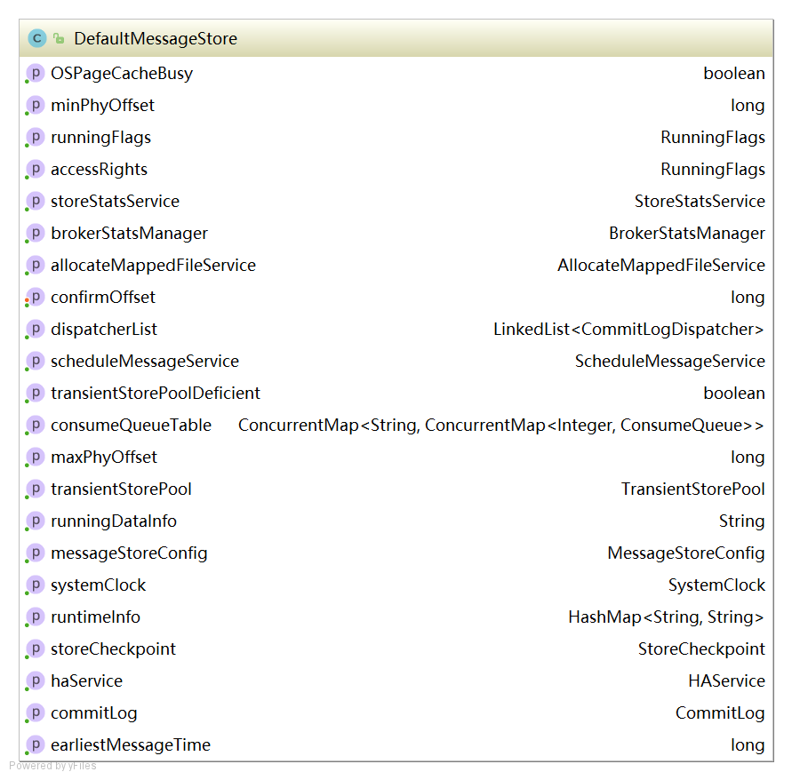

```java
private final MessageStoreConfig messageStoreConfig;	//消息配置属性
private final CommitLog commitLog;		//CommitLog文件存储的实现类
private final ConcurrentMap<String/* topic */, ConcurrentMap<Integer/* queueId */, ConsumeQueue>> consumeQueueTable;	//消息队列存储缓存表,按照消息主题分组
private final FlushConsumeQueueService flushConsumeQueueService;	//消息队列文件刷盘线程
private final CleanCommitLogService cleanCommitLogService;	//清除CommitLog文件服务
private final CleanConsumeQueueService cleanConsumeQueueService;	//清除ConsumerQueue队列文件服务
private final IndexService indexService;	//索引实现类
private final AllocateMappedFileService allocateMappedFileService;	//MappedFile分配服务
private final ReputMessageService reputMessageService;//CommitLog消息分发,根据CommitLog文件构建ConsumerQueue、IndexFile文件
private final HAService haService;	//存储HA机制
private final ScheduleMessageService scheduleMessageService;	//消息服务调度线程
private final StoreStatsService storeStatsService;	//消息存储服务
private final TransientStorePool transientStorePool;	//消息堆外内存缓存
private final BrokerStatsManager brokerStatsManager;	//Broker状态管理器
private final MessageArrivingListener messageArrivingListener;	//消息拉取长轮询模式消息达到监听器
private final BrokerConfig brokerConfig;	//Broker配置类
private StoreCheckpoint storeCheckpoint;	//文件刷盘监测点
private final LinkedList<CommitLogDispatcher> dispatcherList;	//CommitLog文件转发请求
```

### 2.4.2 消息存储流程

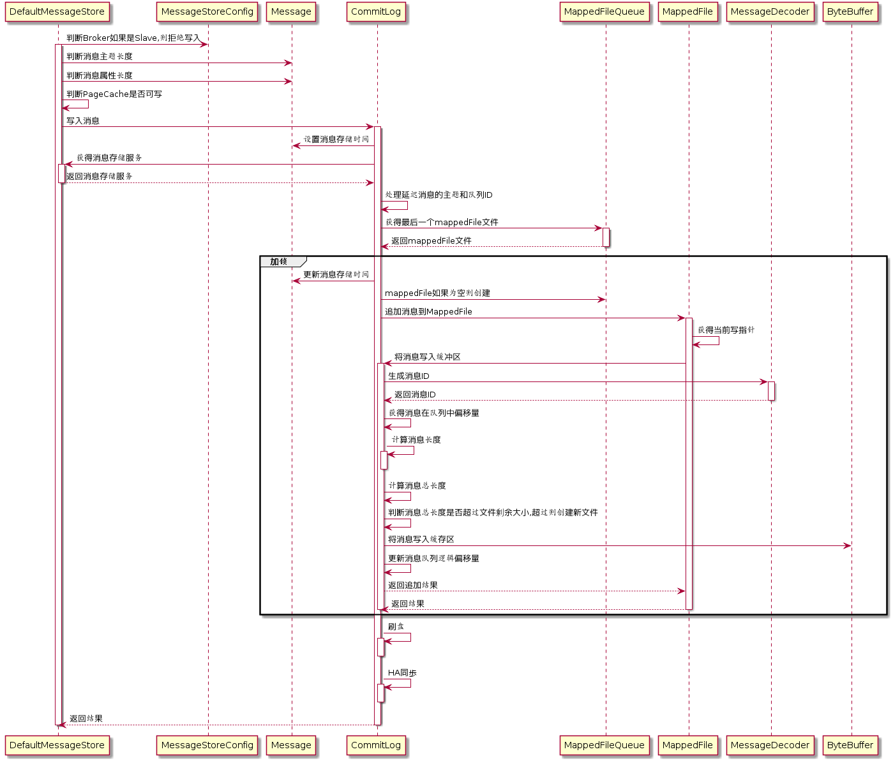

***消息存储入口：DefaultMessageStore#putMessage***

```java
//判断Broker角色如果是从节点,则无需写入
if (BrokerRole.SLAVE == this.messageStoreConfig.getBrokerRole()) {
        long value = this.printTimes.getAndIncrement();
        if ((value % 50000) == 0) {
            log.warn("message store is slave mode, so putMessage is forbidden ");
        }

    return new PutMessageResult(PutMessageStatus.SERVICE_NOT_AVAILABLE, null);
}

//判断当前写入状态如果是正在写入,则不能继续
if (!this.runningFlags.isWriteable()) {
        long value = this.printTimes.getAndIncrement();
    	return new PutMessageResult(PutMessageStatus.SERVICE_NOT_AVAILABLE, null);
} else {
    this.printTimes.set(0);
}
//判断消息主题长度是否超过最大限制
if (msg.getTopic().length() > Byte.MAX_VALUE) {
    log.warn("putMessage message topic length too long " + msg.getTopic().length());
    return new PutMessageResult(PutMessageStatus.MESSAGE_ILLEGAL, null);
}
//判断消息属性长度是否超过限制
if (msg.getPropertiesString() != null && msg.getPropertiesString().length() > Short.MAX_VALUE) {
    log.warn("putMessage message properties length too long " + msg.getPropertiesString().length());
    return new PutMessageResult(PutMessageStatus.PROPERTIES_SIZE_EXCEEDED, null);
}
//判断系统PageCache缓存去是否占用
if (this.isOSPageCacheBusy()) {
    return new PutMessageResult(PutMessageStatus.OS_PAGECACHE_BUSY, null);
}

//将消息写入CommitLog文件
PutMessageResult result = this.commitLog.putMessage(msg);
```

***代码：CommitLog#putMessage***

```java
//记录消息存储时间
msg.setStoreTimestamp(beginLockTimestamp);

//判断如果mappedFile如果为空或者已满,创建新的mappedFile文件
if (null == mappedFile || mappedFile.isFull()) {
    mappedFile = this.mappedFileQueue.getLastMappedFile(0); 
}
//如果创建失败,直接返回
if (null == mappedFile) {
    log.error("create mapped file1 error, topic: " + msg.getTopic() + " clientAddr: " + msg.getBornHostString());
    beginTimeInLock = 0;
    return new PutMessageResult(PutMessageStatus.CREATE_MAPEDFILE_FAILED, null);
}

//写入消息到mappedFile中
result = mappedFile.appendMessage(msg, this.appendMessageCallback);
```

***代码：MappedFile#appendMessagesInner***

```java
//获得文件的写入指针
int currentPos = this.wrotePosition.get();

//如果指针大于文件大小则直接返回
if (currentPos < this.fileSize) {
    //通过writeBuffer.slice()创建一个与MappedFile共享的内存区,并设置position为当前指针
    ByteBuffer byteBuffer = writeBuffer != null ? writeBuffer.slice() : this.mappedByteBuffer.slice();
    byteBuffer.position(currentPos);
    AppendMessageResult result = null;
    if (messageExt instanceof MessageExtBrokerInner) {
       	//通过回调方法写入
        result = cb.doAppend(this.getFileFromOffset(), byteBuffer, this.fileSize - currentPos, (MessageExtBrokerInner) messageExt);
    } else if (messageExt instanceof MessageExtBatch) {
        result = cb.doAppend(this.getFileFromOffset(), byteBuffer, this.fileSize - currentPos, (MessageExtBatch) messageExt);
    } else {
        return new AppendMessageResult(AppendMessageStatus.UNKNOWN_ERROR);
    }
    this.wrotePosition.addAndGet(result.getWroteBytes());
    this.storeTimestamp = result.getStoreTimestamp();
    return result;
}
```

***代码：CommitLog#doAppend***

```java
//文件写入位置
long wroteOffset = fileFromOffset + byteBuffer.position();
//设置消息ID
this.resetByteBuffer(hostHolder, 8);
String msgId = MessageDecoder.createMessageId(this.msgIdMemory, msgInner.getStoreHostBytes(hostHolder), wroteOffset);

//获得该消息在消息队列中的偏移量
keyBuilder.setLength(0);
keyBuilder.append(msgInner.getTopic());
keyBuilder.append('-');
keyBuilder.append(msgInner.getQueueId());
String key = keyBuilder.toString();
Long queueOffset = CommitLog.this.topicQueueTable.get(key);
if (null == queueOffset) {
    queueOffset = 0L;
    CommitLog.this.topicQueueTable.put(key, queueOffset);
}

//获得消息属性长度
final byte[] propertiesData =msgInner.getPropertiesString() == null ? null : msgInner.getPropertiesString().getBytes(MessageDecoder.CHARSET_UTF8);

final int propertiesLength = propertiesData == null ? 0 : propertiesData.length;

if (propertiesLength > Short.MAX_VALUE) {
    log.warn("putMessage message properties length too long. length={}", propertiesData.length);
    return new AppendMessageResult(AppendMessageStatus.PROPERTIES_SIZE_EXCEEDED);
}

//获得消息主题大小
final byte[] topicData = msgInner.getTopic().getBytes(MessageDecoder.CHARSET_UTF8);
final int topicLength = topicData.length;

//获得消息体大小
final int bodyLength = msgInner.getBody() == null ? 0 : msgInner.getBody().length;
//计算消息总长度
final int msgLen = calMsgLength(bodyLength, topicLength, propertiesLength);
```

***代码：CommitLog#calMsgLength***

```java
protected static int calMsgLength(int bodyLength, int topicLength, int propertiesLength) {
    final int msgLen = 4 //TOTALSIZE
        + 4 //MAGICCODE  
        + 4 //BODYCRC
        + 4 //QUEUEID
        + 4 //FLAG
        + 8 //QUEUEOFFSET
        + 8 //PHYSICALOFFSET
        + 4 //SYSFLAG
        + 8 //BORNTIMESTAMP
        + 8 //BORNHOST
        + 8 //STORETIMESTAMP
        + 8 //STOREHOSTADDRESS
        + 4 //RECONSUMETIMES
        + 8 //Prepared Transaction Offset
        + 4 + (bodyLength > 0 ? bodyLength : 0) //BODY
        + 1 + topicLength //TOPIC
        + 2 + (propertiesLength > 0 ? propertiesLength : 0) //propertiesLength
        + 0;
    return msgLen;
}
```

***代码：CommitLog#doAppend***

```java
//消息长度不能超过4M
if (msgLen > this.maxMessageSize) {
    CommitLog.log.warn("message size exceeded, msg total size: " + msgLen + ", msg body size: " + bodyLength
        + ", maxMessageSize: " + this.maxMessageSize);
    return new AppendMessageResult(AppendMessageStatus.MESSAGE_SIZE_EXCEEDED);
}

//消息是如果没有足够的存储空间则新创建CommitLog文件
if ((msgLen + END_FILE_MIN_BLANK_LENGTH) > maxBlank) {
    this.resetByteBuffer(this.msgStoreItemMemory, maxBlank);
    // 1 TOTALSIZE
    this.msgStoreItemMemory.putInt(maxBlank);
    // 2 MAGICCODE
    this.msgStoreItemMemory.putInt(CommitLog.BLANK_MAGIC_CODE);
    // 3 The remaining space may be any value
    // Here the length of the specially set maxBlank
    final long beginTimeMills = CommitLog.this.defaultMessageStore.now();
    byteBuffer.put(this.msgStoreItemMemory.array(), 0, maxBlank);
    return new AppendMessageResult(AppendMessageStatus.END_OF_FILE, wroteOffset, maxBlank, msgId, msgInner.getStoreTimestamp(),
        queueOffset, CommitLog.this.defaultMessageStore.now() - beginTimeMills);
}

//将消息存储到ByteBuffer中,返回AppendMessageResult
final long beginTimeMills = CommitLog.this.defaultMessageStore.now();
// Write messages to the queue buffer
byteBuffer.put(this.msgStoreItemMemory.array(), 0, msgLen);
AppendMessageResult result = new AppendMessageResult(AppendMessageStatus.PUT_OK, wroteOffset, 
                                                     msgLen, msgId,msgInner.getStoreTimestamp(), 
                                                     queueOffset, 
                                                     CommitLog.this.defaultMessageStore.now() 
                                                     -beginTimeMills);
switch (tranType) {
    case MessageSysFlag.TRANSACTION_PREPARED_TYPE:
    case MessageSysFlag.TRANSACTION_ROLLBACK_TYPE:
        break;
    case MessageSysFlag.TRANSACTION_NOT_TYPE:
    case MessageSysFlag.TRANSACTION_COMMIT_TYPE:
        //更新消息队列偏移量
        CommitLog.this.topicQueueTable.put(key, ++queueOffset);
        break;
    default:
        break;
}
```

***代码：CommitLog#putMessage***

```java
//释放锁
putMessageLock.unlock();
//刷盘
handleDiskFlush(result, putMessageResult, msg);
//执行HA主从同步
handleHA(result, putMessageResult, msg);
```

### 2.4.3 存储文件


- commitLog：消息存储目录
- config：运行期间一些配置信息
- consumerqueue：消息消费队列存储目录
- index：消息索引文件存储目录
- abort：如果存在改文件寿命Broker非正常关闭
- checkpoint：文件检查点，存储CommitLog文件最后一次刷盘时间戳、consumerquueue最后一次刷盘时间，index索引文件最后一次刷盘时间戳。

### 2.4.4 存储文件内存映射

RocketMQ通过使用内存映射文件提高IO访问性能，无论是CommitLog、ConsumerQueue还是IndexFile，单个文件都被设计为固定长度，如果一个文件写满以后再创建一个新文件，文件名就为该文件第一条消息对应的全局物理偏移量。

####1）MappedFileQueue


```java
String storePath;	//存储目录
int mappedFileSize;	// 单个文件大小
CopyOnWriteArrayList<MappedFile> mappedFiles;	//MappedFile文件集合
AllocateMappedFileService allocateMappedFileService;	//创建MapFile服务类
long flushedWhere = 0;		//当前刷盘指针
long committedWhere = 0;	//当前数据提交指针,内存中ByteBuffer当前的写指针,该值大于等于flushWhere
```

* 根据存储时间查询MappedFile

```java
public MappedFile getMappedFileByTime(final long timestamp) {
    Object[] mfs = this.copyMappedFiles(0);
	
    if (null == mfs)
        return null;
	//遍历MappedFile文件数组
    for (int i = 0; i < mfs.length; i++) {
        MappedFile mappedFile = (MappedFile) mfs[i];
        //MappedFile文件的最后修改时间大于指定时间戳则返回该文件
        if (mappedFile.getLastModifiedTimestamp() >= timestamp) {
            return mappedFile;
        }
    }

    return (MappedFile) mfs[mfs.length - 1];
}
```

* 根据消息偏移量offset查找MappedFile

```java
public MappedFile findMappedFileByOffset(final long offset, final boolean returnFirstOnNotFound) {
    try {
        //获得第一个MappedFile文件
        MappedFile firstMappedFile = this.getFirstMappedFile();
        //获得最后一个MappedFile文件
        MappedFile lastMappedFile = this.getLastMappedFile();
        //第一个文件和最后一个文件均不为空,则进行处理
        if (firstMappedFile != null && lastMappedFile != null) {
            if (offset < firstMappedFile.getFileFromOffset() || 
                offset >= lastMappedFile.getFileFromOffset() + this.mappedFileSize) {
            } else {
                //获得文件索引
                int index = (int) ((offset / this.mappedFileSize) 
                                   - (firstMappedFile.getFileFromOffset() / this.mappedFileSize));
                MappedFile targetFile = null;
                try {
                    //根据索引返回目标文件
                    targetFile = this.mappedFiles.get(index);
                } catch (Exception ignored) {
                }

                if (targetFile != null && offset >= targetFile.getFileFromOffset()
                    && offset < targetFile.getFileFromOffset() + this.mappedFileSize) {
                    return targetFile;
                }

                for (MappedFile tmpMappedFile : this.mappedFiles) {
                    if (offset >= tmpMappedFile.getFileFromOffset()
                        && offset < tmpMappedFile.getFileFromOffset() + this.mappedFileSize) {
                        return tmpMappedFile;
                    }
                }
            }

            if (returnFirstOnNotFound) {
                return firstMappedFile;
            }
        }
    } catch (Exception e) {
        log.error("findMappedFileByOffset Exception", e);
    }

    return null;
}
```

* 获取存储文件最小偏移量

```java
public long getMinOffset() {

    if (!this.mappedFiles.isEmpty()) {
        try {
            return this.mappedFiles.get(0).getFileFromOffset();
        } catch (IndexOutOfBoundsException e) {
            //continue;
        } catch (Exception e) {
            log.error("getMinOffset has exception.", e);
        }
    }
    return -1;
}
```

* 获取存储文件最大偏移量

```java
public long getMaxOffset() {
    MappedFile mappedFile = getLastMappedFile();
    if (mappedFile != null) {
        return mappedFile.getFileFromOffset() + mappedFile.getReadPosition();
    }
    return 0;
}
```

* 返回存储文件当前写指针

```java
public long getMaxWrotePosition() {
    MappedFile mappedFile = getLastMappedFile();
    if (mappedFile != null) {
        return mappedFile.getFileFromOffset() + mappedFile.getWrotePosition();
    }
    return 0;
}
```

####2）MappedFile


```java
int OS_PAGE_SIZE = 1024 * 4;		//操作系统每页大小,默认4K
AtomicLong TOTAL_MAPPED_VIRTUAL_MEMORY = new AtomicLong(0);	//当前JVM实例中MappedFile虚拟内存
AtomicInteger TOTAL_MAPPED_FILES = new AtomicInteger(0);	//当前JVM实例中MappedFile对象个数
AtomicInteger wrotePosition = new AtomicInteger(0);	//当前文件的写指针
AtomicInteger committedPosition = new AtomicInteger(0);	//当前文件的提交指针
AtomicInteger flushedPosition = new AtomicInteger(0);	//刷写到磁盘指针
int fileSize;	//文件大小
FileChannel fileChannel;	//文件通道	
ByteBuffer writeBuffer = null;	//堆外内存ByteBuffer
TransientStorePool transientStorePool = null;	//堆外内存池
String fileName;	//文件名称
long fileFromOffset;	//该文件的处理偏移量
File file;	//物理文件
MappedByteBuffer mappedByteBuffer;	//物理文件对应的内存映射Buffer
volatile long storeTimestamp = 0;	//文件最后一次内容写入时间
boolean firstCreateInQueue = false;	//是否是MappedFileQueue队列中第一个文件
```

***MappedFile初始化***

* 未开启`transientStorePoolEnable`。`transientStorePoolEnable=true`为`true`表示数据先存储到堆外内存，然后通过`Commit`线程将数据提交到内存映射Buffer中，再通过`Flush`线程将内存映射`Buffer`中数据持久化磁盘。

```java
private void init(final String fileName, final int fileSize) throws IOException {
    this.fileName = fileName;
    this.fileSize = fileSize;
    this.file = new File(fileName);
    this.fileFromOffset = Long.parseLong(this.file.getName());
    boolean ok = false;
	
    ensureDirOK(this.file.getParent());

    try {
        this.fileChannel = new RandomAccessFile(this.file, "rw").getChannel();
        this.mappedByteBuffer = this.fileChannel.map(MapMode.READ_WRITE, 0, fileSize);
        TOTAL_MAPPED_VIRTUAL_MEMORY.addAndGet(fileSize);
        TOTAL_MAPPED_FILES.incrementAndGet();
        ok = true;
    } catch (FileNotFoundException e) {
        log.error("create file channel " + this.fileName + " Failed. ", e);
        throw e;
    } catch (IOException e) {
        log.error("map file " + this.fileName + " Failed. ", e);
        throw e;
    } finally {
        if (!ok && this.fileChannel != null) {
            this.fileChannel.close();
        }
    }
}
```

开启`transientStorePoolEnable`

```java
public void init(final String fileName, final int fileSize,
    final TransientStorePool transientStorePool) throws IOException {
    init(fileName, fileSize);
    this.writeBuffer = transientStorePool.borrowBuffer();	//初始化writeBuffer
    this.transientStorePool = transientStorePool;
}
```

***MappedFile提交***

提交数据到FileChannel，commitLeastPages为本次提交最小的页数，如果待提交数据不满commitLeastPages，则不执行本次提交操作。如果writeBuffer如果为空，直接返回writePosition指针，无需执行commit操作，表名commit操作主体是writeBuffer。

```java
public int commit(final int commitLeastPages) {
    if (writeBuffer == null) {
        //no need to commit data to file channel, so just regard wrotePosition as committedPosition.
        return this.wrotePosition.get();
    }
    //判断是否满足提交条件
    if (this.isAbleToCommit(commitLeastPages)) {
        if (this.hold()) {
            commit0(commitLeastPages);
            this.release();
        } else {
            log.warn("in commit, hold failed, commit offset = " + this.committedPosition.get());
        }
    }

    // 所有数据提交后,清空缓冲区
    if (writeBuffer != null && this.transientStorePool != null && this.fileSize == this.committedPosition.get()) {
        this.transientStorePool.returnBuffer(writeBuffer);
        this.writeBuffer = null;
    }

    return this.committedPosition.get();
}
```

***MappedFile#isAbleToCommit***

判断是否执行commit操作，如果文件已满返回true；如果commitLeastpages大于0，则比较writePosition与上一次提交的指针commitPosition的差值，除以OS_PAGE_SIZE得到当前脏页的数量，如果大于commitLeastPages则返回true，如果commitLeastpages小于0表示只要存在脏页就提交。

```java
protected boolean isAbleToCommit(final int commitLeastPages) {
    //已经刷盘指针
    int flush = this.committedPosition.get();
    //文件写指针
    int write = this.wrotePosition.get();
	//写满刷盘
    if (this.isFull()) {
        return true;
    }

    if (commitLeastPages > 0) {
        //文件内容达到commitLeastPages页数,则刷盘
        return ((write / OS_PAGE_SIZE) - (flush / OS_PAGE_SIZE)) >= commitLeastPages;
    }

    return write > flush;
}
```

***MappedFile#commit0***

具体提交的实现，首先创建WriteBuffer区共享缓存区，然后将新创建的position回退到上一次提交的位置（commitPosition），设置limit为wrotePosition（当前最大有效数据指针），然后把commitPosition到wrotePosition的数据写入到FileChannel中，然后更新committedPosition指针为wrotePosition。commit的作用就是将MappedFile的writeBuffer中数据提交到文件通道FileChannel中。

```java
protected void commit0(final int commitLeastPages) {
    //写指针
    int writePos = this.wrotePosition.get();
    //上次提交指针
    int lastCommittedPosition = this.committedPosition.get();

    if (writePos - this.committedPosition.get() > 0) {
        try {
            //复制共享内存区域
            ByteBuffer byteBuffer = writeBuffer.slice();
            //设置提交位置是上次提交位置
            byteBuffer.position(lastCommittedPosition);
            //最大提交数量
            byteBuffer.limit(writePos);
            //设置fileChannel位置为上次提交位置
            this.fileChannel.position(lastCommittedPosition);
            //将lastCommittedPosition到writePos的数据复制到FileChannel中
            this.fileChannel.write(byteBuffer);
            //重置提交位置
            this.committedPosition.set(writePos);
        } catch (Throwable e) {
            log.error("Error occurred when commit data to FileChannel.", e);
        }
    }
}
```

***MappedFile#flush***

刷写磁盘，直接调用MappedByteBuffer或fileChannel的force方法将内存中的数据持久化到磁盘，那么flushedPosition应该等于MappedByteBuffer中的写指针；如果writeBuffer不为空，则flushPosition应该等于上一次的commit指针；因为上一次提交的数据就是进入到MappedByteBuffer中的数据；如果writeBuffer为空，数据时直接进入到MappedByteBuffer，wrotePosition代表的是MappedByteBuffer中的指针，故设置flushPosition为wrotePosition。


```java
public int flush(final int flushLeastPages) {
    //数据达到刷盘条件
    if (this.isAbleToFlush(flushLeastPages)) {
        //加锁，同步刷盘
        if (this.hold()) {
            //获得读指针
            int value = getReadPosition();
            try {
                //数据从writeBuffer提交数据到fileChannel再刷新到磁盘
                if (writeBuffer != null || this.fileChannel.position() != 0) {
                    this.fileChannel.force(false);
                } else {
                    //从mmap刷新数据到磁盘
                    this.mappedByteBuffer.force();
                }
            } catch (Throwable e) {
                log.error("Error occurred when force data to disk.", e);
            }
			//更新刷盘位置
            this.flushedPosition.set(value);
            this.release();
        } else {
            log.warn("in flush, hold failed, flush offset = " + this.flushedPosition.get());
            this.flushedPosition.set(getReadPosition());
        }
    }
    return this.getFlushedPosition();
}
```

***MappedFile#getReadPosition***

获取当前文件最大可读指针。如果writeBuffer为空，则直接返回当前的写指针；如果writeBuffer不为空，则返回上一次提交的指针。在MappedFile设置中,只有提交了的数据（写入到MappedByteBuffer或FileChannel中的数据）才是安全的数据

```java
public int getReadPosition() {
    //如果writeBuffer为空,刷盘的位置就是应该等于上次commit的位置,如果为空则为mmap的写指针
    return this.writeBuffer == null ? this.wrotePosition.get() : this.committedPosition.get();
}
```

***MappedFile#selectMappedBuffer***

查找pos到当前最大可读之间的数据，由于在整个写入期间都未曾改MappedByteBuffer的指针，如果mappedByteBuffer.slice()方法返回的共享缓存区空间为整个MappedFile，然后通过设置ByteBuffer的position为待查找的值，读取字节长度当前可读最大长度，最终返回的ByteBuffer的limit为size。整个共享缓存区的容量为（MappedFile#fileSize-pos）。故在操作SelectMappedBufferResult不能对包含在里面的ByteBuffer调用filp方法。

```java
public SelectMappedBufferResult selectMappedBuffer(int pos) {
    //获得最大可读指针
    int readPosition = getReadPosition();
    //pos小于最大可读指针,并且大于0
    if (pos < readPosition && pos >= 0) {
        if (this.hold()) {
            //复制mappedByteBuffer读共享区
            ByteBuffer byteBuffer = this.mappedByteBuffer.slice();
            //设置读指针位置
            byteBuffer.position(pos);
            //获得可读范围
            int size = readPosition - pos;
            //设置最大刻度范围
            ByteBuffer byteBufferNew = byteBuffer.slice();
            byteBufferNew.limit(size);
            return new SelectMappedBufferResult(this.fileFromOffset + pos, byteBufferNew, size, this);
        }
    }

    return null;
}
```

***MappedFile#shutdown***

MappedFile文件销毁的实现方法为public boolean destory(long intervalForcibly)，intervalForcibly表示拒绝被销毁的最大存活时间。

```java
public void shutdown(final long intervalForcibly) {
    if (this.available) {
        //关闭MapedFile
        this.available = false;
        //设置当前关闭时间戳
        this.firstShutdownTimestamp = System.currentTimeMillis();
        //释放资源
        this.release();
    } else if (this.getRefCount() > 0) {
        if ((System.currentTimeMillis() - this.firstShutdownTimestamp) >= intervalForcibly) {
            this.refCount.set(-1000 - this.getRefCount());
            this.release();
        }
    }
}
```

#### 3）TransientStorePool

短暂的存储池。RocketMQ单独创建一个MappedByteBuffer内存缓存池，用来临时存储数据，数据先写入该内存映射中，然后由commit线程定时将数据从该内存复制到与目标物理文件对应的内存映射中。RocketMQ引入该机制主要的原因是提供一种内存锁定，将当前堆外内存一直锁定在内存中，避免被进程将内存交换到磁盘。

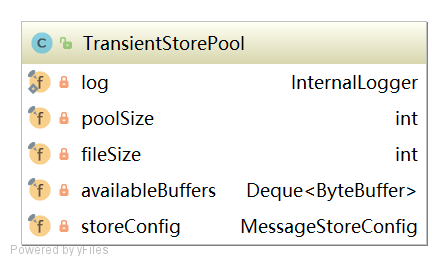

```java
private final int poolSize;		//availableBuffers个数
private final int fileSize;		//每隔ByteBuffer大小
private final Deque<ByteBuffer> availableBuffers;	//ByteBuffer容器。双端队列
```

***初始化***

```java
public void init() {
    //创建poolSize个堆外内存
    for (int i = 0; i < poolSize; i++) {
        ByteBuffer byteBuffer = ByteBuffer.allocateDirect(fileSize);
        final long address = ((DirectBuffer) byteBuffer).address();
        Pointer pointer = new Pointer(address);
        //使用com.sun.jna.Library类库将该批内存锁定,避免被置换到交换区,提高存储性能
        LibC.INSTANCE.mlock(pointer, new NativeLong(fileSize));

        availableBuffers.offer(byteBuffer);
    }
}
```

### 2.4.5 实时更新消息消费队列与索引文件

消息消费队文件、消息属性索引文件都是基于CommitLog文件构建的，当消息生产者提交的消息存储在CommitLog文件中，ConsumerQueue、IndexFile需要及时更新，否则消息无法及时被消费，根据消息属性查找消息也会出现较大延迟。RocketMQ通过开启一个线程ReputMessageService来准实时转发CommitLog文件更新事件，相应的任务处理器根据转发的消息及时更新ConsumerQueue、IndexFile文件。


***代码：DefaultMessageStore：start***

```java
//设置CommitLog内存中最大偏移量
this.reputMessageService.setReputFromOffset(maxPhysicalPosInLogicQueue);
//启动
this.reputMessageService.start();
```

***代码：DefaultMessageStore：run***

```java
public void run() {
    DefaultMessageStore.log.info(this.getServiceName() + " service started");
	//每隔1毫秒就继续尝试推送消息到消息消费队列和索引文件
    while (!this.isStopped()) {
        try {
            Thread.sleep(1);
            this.doReput();
        } catch (Exception e) {
            DefaultMessageStore.log.warn(this.getServiceName() + " service has exception. ", e);
        }
    }

    DefaultMessageStore.log.info(this.getServiceName() + " service end");
}
```

***代码：DefaultMessageStore：deReput***

```java
//从result中循环遍历消息,一次读一条,创建DispatherRequest对象。
for (int readSize = 0; readSize < result.getSize() && doNext; ) {
	DispatchRequest dispatchRequest =                               DefaultMessageStore.this.commitLog.checkMessageAndReturnSize(result.getByteBuffer(), false, false);
	int size = dispatchRequest.getBufferSize() == -1 ? dispatchRequest.getMsgSize() : dispatchRequest.getBufferSize();

	if (dispatchRequest.isSuccess()) {
	    if (size > 0) {
	        DefaultMessageStore.this.doDispatch(dispatchRequest);
	    }
    }
}
```

***DispatchRequest***


```java
String topic; //消息主题名称
int queueId;  //消息队列ID
long commitLogOffset;	//消息物理偏移量
int msgSize;	//消息长度
long tagsCode;	//消息过滤tag hashCode
long storeTimestamp;	//消息存储时间戳
long consumeQueueOffset;	//消息队列偏移量
String keys;	//消息索引key
boolean success;	//是否成功解析到完整的消息
String uniqKey;	//消息唯一键
int sysFlag;	//消息系统标记
long preparedTransactionOffset;	//消息预处理事务偏移量
Map<String, String> propertiesMap;	//消息属性
byte[] bitMap;	//位图
```

#### 1）转发到ConsumerQueue


```java
class CommitLogDispatcherBuildConsumeQueue implements CommitLogDispatcher {
    @Override
    public void dispatch(DispatchRequest request) {
        final int tranType = MessageSysFlag.getTransactionValue(request.getSysFlag());
        switch (tranType) {
            case MessageSysFlag.TRANSACTION_NOT_TYPE:
            case MessageSysFlag.TRANSACTION_COMMIT_TYPE:
                //消息分发
                DefaultMessageStore.this.putMessagePositionInfo(request);
                break;
            case MessageSysFlag.TRANSACTION_PREPARED_TYPE:
            case MessageSysFlag.TRANSACTION_ROLLBACK_TYPE:
                break;
        }
    }
}
```

***代码：DefaultMessageStore#putMessagePositionInfo***

```java
public void putMessagePositionInfo(DispatchRequest dispatchRequest) {
    //获得消费队列
    ConsumeQueue cq = this.findConsumeQueue(dispatchRequest.getTopic(), dispatchRequest.getQueueId());
    //消费队列分发消息
    cq.putMessagePositionInfoWrapper(dispatchRequest);
}
```

***代码：DefaultMessageStore#putMessagePositionInfo***

```java
//依次将消息偏移量、消息长度、tag写入到ByteBuffer中
this.byteBufferIndex.flip();
this.byteBufferIndex.limit(CQ_STORE_UNIT_SIZE);
this.byteBufferIndex.putLong(offset);
this.byteBufferIndex.putInt(size);
this.byteBufferIndex.putLong(tagsCode);
//获得内存映射文件
MappedFile mappedFile = this.mappedFileQueue.getLastMappedFile(expectLogicOffset);
if (mappedFile != null) {
    //将消息追加到内存映射文件,异步输盘
    return mappedFile.appendMessage(this.byteBufferIndex.array());
}
```

#### 2）转发到Index


```java
class CommitLogDispatcherBuildIndex implements CommitLogDispatcher {

    @Override
    public void dispatch(DispatchRequest request) {
        if (DefaultMessageStore.this.messageStoreConfig.isMessageIndexEnable()) {
            DefaultMessageStore.this.indexService.buildIndex(request);
        }
    }
}
```

***代码：DefaultMessageStore#buildIndex***

```java
public void buildIndex(DispatchRequest req) {
    //获得索引文件
    IndexFile indexFile = retryGetAndCreateIndexFile();
    if (indexFile != null) {
        //获得文件最大物理偏移量
        long endPhyOffset = indexFile.getEndPhyOffset();
        DispatchRequest msg = req;
        String topic = msg.getTopic();
        String keys = msg.getKeys();
        //如果该消息的物理偏移量小于索引文件中的最大物理偏移量,则说明是重复数据,忽略本次索引构建
        if (msg.getCommitLogOffset() < endPhyOffset) {
            return;
        }

        final int tranType = MessageSysFlag.getTransactionValue(msg.getSysFlag());
        switch (tranType) {
            case MessageSysFlag.TRANSACTION_NOT_TYPE:
            case MessageSysFlag.TRANSACTION_PREPARED_TYPE:
            case MessageSysFlag.TRANSACTION_COMMIT_TYPE:
                break;
            case MessageSysFlag.TRANSACTION_ROLLBACK_TYPE:
                return;
        }
		
        //如果消息ID不为空,则添加到Hash索引中
        if (req.getUniqKey() != null) {
            indexFile = putKey(indexFile, msg, buildKey(topic, req.getUniqKey()));
            if (indexFile == null) {
                return;
            }
        }
		//构建索引key,RocketMQ支持为同一个消息建立多个索引,多个索引键空格隔开.
        if (keys != null && keys.length() > 0) {
            String[] keyset = keys.split(MessageConst.KEY_SEPARATOR);
            for (int i = 0; i < keyset.length; i++) {
                String key = keyset[i];
                if (key.length() > 0) {
                    indexFile = putKey(indexFile, msg, buildKey(topic, key));
                    if (indexFile == null) {

                        return;
                    }
                }
            }
        }
    } else {
        log.error("build index error, stop building index");
    }
}
```

### 2.4.6 消息队列和索引文件恢复

由于RocketMQ存储首先将消息全量存储在CommitLog文件中，然后异步生成转发任务更新ConsumerQueue和Index文件。如果消息成功存储到CommitLog文件中，转发任务未成功执行，此时消息服务器Broker由于某个愿意宕机，导致CommitLog、ConsumerQueue、IndexFile文件数据不一致。如果不加以人工修复的话，会有一部分消息即便在CommitLog中文件中存在，但由于没有转发到ConsumerQueue，这部分消息将永远复发被消费者消费。


####1）存储文件加载

***代码：DefaultMessageStore#load***

判断上一次是否异常退出。实现机制是Broker在启动时创建abort文件，在退出时通过JVM钩子函数删除abort文件。如果下次启动时存在abort文件。说明Broker时异常退出的，CommitLog与ConsumerQueue数据有可能不一致，需要进行修复。

```java
//判断临时文件是否存在
boolean lastExitOK = !this.isTempFileExist();
//根据临时文件判断当前Broker是否异常退出
private boolean isTempFileExist() {
    String fileName = StorePathConfigHelper
        .getAbortFile(this.messageStoreConfig.getStorePathRootDir());
    File file = new File(fileName);
    return file.exists();
}
```

***代码：DefaultMessageStore#load***

```java
//加载延时队列
if (null != scheduleMessageService) {
    result = result && this.scheduleMessageService.load();
}

// 加载CommitLog文件
result = result && this.commitLog.load();

// 加载消费队列文件
result = result && this.loadConsumeQueue();

if (result) {
	//加载存储监测点,监测点主要记录CommitLog文件、ConsumerQueue文件、Index索引文件的刷盘点
    this.storeCheckpoint =new StoreCheckpoint(StorePathConfigHelper.getStoreCheckpoint(this.messageStoreConfig.getStorePathRootDir()));
	//加载index文件
    this.indexService.load(lastExitOK);
	//根据Broker是否异常退出,执行不同的恢复策略
    this.recover(lastExitOK);
}
```

***代码：MappedFileQueue#load***

加载CommitLog到映射文件

```java
//指向CommitLog文件目录
File dir = new File(this.storePath);
//获得文件数组
File[] files = dir.listFiles();
if (files != null) {
    // 文件排序
    Arrays.sort(files);
    //遍历文件
    for (File file : files) {
		//如果文件大小和配置文件不一致,退出
        if (file.length() != this.mappedFileSize) {
            
            return false;
        }

        try {
            //创建映射文件
            MappedFile mappedFile = new MappedFile(file.getPath(), mappedFileSize);
            mappedFile.setWrotePosition(this.mappedFileSize);
            mappedFile.setFlushedPosition(this.mappedFileSize);
            mappedFile.setCommittedPosition(this.mappedFileSize);
            //将映射文件添加到队列
            this.mappedFiles.add(mappedFile);
            log.info("load " + file.getPath() + " OK");
        } catch (IOException e) {
            log.error("load file " + file + " error", e);
            return false;
        }
    }
}

return true;
```

***代码：DefaultMessageStore#loadConsumeQueue***

加载消息消费队列

```java
//执行消费队列目录
File dirLogic = new File(StorePathConfigHelper.getStorePathConsumeQueue(this.messageStoreConfig.getStorePathRootDir()));
//遍历消费队列目录
File[] fileTopicList = dirLogic.listFiles();
if (fileTopicList != null) {

    for (File fileTopic : fileTopicList) {
        //获得子目录名称,即topic名称
        String topic = fileTopic.getName();
		//遍历子目录下的消费队列文件
        File[] fileQueueIdList = fileTopic.listFiles();
        if (fileQueueIdList != null) {
            //遍历文件
            for (File fileQueueId : fileQueueIdList) {
                //文件名称即队列ID
                int queueId;
                try {
                    queueId = Integer.parseInt(fileQueueId.getName());
                } catch (NumberFormatException e) {
                    continue;
                }
                //创建消费队列并加载到内存
                ConsumeQueue logic = new ConsumeQueue(
                    topic,
                    queueId,
                    StorePathConfigHelper.getStorePathConsumeQueue(this.messageStoreConfig.getStorePathRootDir()),
            this.getMessageStoreConfig().getMapedFileSizeConsumeQueue(),
                    this);
                this.putConsumeQueue(topic, queueId, logic);
                if (!logic.load()) {
                    return false;
                }
            }
        }
    }
}

log.info("load logics queue all over, OK");

return true;
```

***代码：IndexService#load***

加载索引文件

```java
public boolean load(final boolean lastExitOK) {
    //索引文件目录
    File dir = new File(this.storePath);
    //遍历索引文件
    File[] files = dir.listFiles();
    if (files != null) {
        //文件排序
        Arrays.sort(files);
        //遍历文件
        for (File file : files) {
            try {
                //加载索引文件
                IndexFile f = new IndexFile(file.getPath(), this.hashSlotNum, this.indexNum, 0, 0);
                f.load();

                if (!lastExitOK) {
                    //索引文件上次的刷盘时间小于该索引文件的消息时间戳,该文件将立即删除
                    if (f.getEndTimestamp() > this.defaultMessageStore.getStoreCheckpoint()
                        .getIndexMsgTimestamp()) {
                        f.destroy(0);
                        continue;
                    }
                }
				//将索引文件添加到队列
                log.info("load index file OK, " + f.getFileName());
                this.indexFileList.add(f);
            } catch (IOException e) {
                log.error("load file {} error", file, e);
                return false;
            } catch (NumberFormatException e) {
                log.error("load file {} error", file, e);
            }
        }
    }

    return true;
}
```

***代码：DefaultMessageStore#recover***

文件恢复，根据Broker是否正常退出执行不同的恢复策略

```java
private void recover(final boolean lastExitOK) {
    //获得最大的物理便宜消费队列
    long maxPhyOffsetOfConsumeQueue = this.recoverConsumeQueue();

    if (lastExitOK) {
        //正常恢复
        this.commitLog.recoverNormally(maxPhyOffsetOfConsumeQueue);
    } else {
        //异常恢复
        this.commitLog.recoverAbnormally(maxPhyOffsetOfConsumeQueue);
    }
	//在CommitLog中保存每个消息消费队列当前的存储逻辑偏移量
    this.recoverTopicQueueTable();
}
```

***代码：DefaultMessageStore#recoverTopicQueueTable***

恢复ConsumerQueue后，将在CommitLog实例中保存每隔消息队列当前的存储逻辑偏移量，这也是消息中不仅存储主题、消息队列ID、还存储了消息队列的关键所在。

```java
public void recoverTopicQueueTable() {
    HashMap<String/* topic-queueid */, Long/* offset */> table = new HashMap<String, Long>(1024);
    //CommitLog最小偏移量
    long minPhyOffset = this.commitLog.getMinOffset();
    //遍历消费队列,将消费队列保存在CommitLog中
    for (ConcurrentMap<Integer, ConsumeQueue> maps : this.consumeQueueTable.values()) {
        for (ConsumeQueue logic : maps.values()) {
            String key = logic.getTopic() + "-" + logic.getQueueId();
            table.put(key, logic.getMaxOffsetInQueue());
            logic.correctMinOffset(minPhyOffset);
        }
    }
    this.commitLog.setTopicQueueTable(table);
}
```

####2）正常恢复

***代码：CommitLog#recoverNormally***

```java
public void recoverNormally(long maxPhyOffsetOfConsumeQueue) {
	
    final List<MappedFile> mappedFiles = this.mappedFileQueue.getMappedFiles();
    if (!mappedFiles.isEmpty()) {
         //Broker正常停止再重启时,从倒数第三个开始恢复,如果不足3个文件,则从第一个文件开始恢复。
        int index = mappedFiles.size() - 3;
        if (index < 0)
            index = 0;
        MappedFile mappedFile = mappedFiles.get(index);
        ByteBuffer byteBuffer = mappedFile.sliceByteBuffer();
        long processOffset = mappedFile.getFileFromOffset();
        //代表当前已校验通过的offset
        long mappedFileOffset = 0;
        while (true) {
            //查找消息
            DispatchRequest dispatchRequest = this.checkMessageAndReturnSize(byteBuffer, checkCRCOnRecover);
            //消息长度
            int size = dispatchRequest.getMsgSize();
           	//查找结果为true,并且消息长度大于0,表示消息正确.mappedFileOffset向前移动本消息长度
            if (dispatchRequest.isSuccess() && size > 0) {
                mappedFileOffset += size;
            }
			//如果查找结果为true且消息长度等于0,表示已到该文件末尾,如果还有下一个文件,则重置processOffset和MappedFileOffset重复查找下一个文件,否则跳出循环。
            else if (dispatchRequest.isSuccess() && size == 0) {
              index++;
              if (index >= mappedFiles.size()) {
                  // Current branch can not happen
                  break;
              } else {
                  //取出每个文件
                  mappedFile = mappedFiles.get(index);
                  byteBuffer = mappedFile.sliceByteBuffer();
                  processOffset = mappedFile.getFileFromOffset();
                  mappedFileOffset = 0;
                  
          		}
            }
            // 查找结果为false，表明该文件未填满所有消息，跳出循环，结束循环
            else if (!dispatchRequest.isSuccess()) {
                log.info("recover physics file end, " + mappedFile.getFileName());
                break;
            }
        }
		//更新MappedFileQueue的flushedWhere和committedWhere指针
        processOffset += mappedFileOffset;
        this.mappedFileQueue.setFlushedWhere(processOffset);
        this.mappedFileQueue.setCommittedWhere(processOffset);
        //删除offset之后的所有文件
        this.mappedFileQueue.truncateDirtyFiles(processOffset);

        
        if (maxPhyOffsetOfConsumeQueue >= processOffset) {
            this.defaultMessageStore.truncateDirtyLogicFiles(processOffset);
        }
    } else {
        this.mappedFileQueue.setFlushedWhere(0);
        this.mappedFileQueue.setCommittedWhere(0);
        this.defaultMessageStore.destroyLogics();
    }
}
```

***代码：MappedFileQueue#truncateDirtyFiles***

```java
public void truncateDirtyFiles(long offset) {
    List<MappedFile> willRemoveFiles = new ArrayList<MappedFile>();
	//遍历目录下文件
    for (MappedFile file : this.mappedFiles) {
        //文件尾部的偏移量
        long fileTailOffset = file.getFileFromOffset() + this.mappedFileSize;
        //文件尾部的偏移量大于offset
        if (fileTailOffset > offset) {
            //offset大于文件的起始偏移量
            if (offset >= file.getFileFromOffset()) {
                //更新wrotePosition、committedPosition、flushedPosistion
                file.setWrotePosition((int) (offset % this.mappedFileSize));
                file.setCommittedPosition((int) (offset % this.mappedFileSize));
                file.setFlushedPosition((int) (offset % this.mappedFileSize));
            } else {
                //offset小于文件的起始偏移量,说明该文件是有效文件后面创建的,释放mappedFile占用内存,删除文件
                file.destroy(1000);
                willRemoveFiles.add(file);
            }
        }
    }

    this.deleteExpiredFile(willRemoveFiles);
}
```

####3）异常恢复

Broker异常停止文件恢复的实现为CommitLog#recoverAbnormally。异常文件恢复步骤与正常停止文件恢复流程基本相同，其主要差别有两个。首先，正常停止默认从倒数第三个文件开始进行恢复，而异常停止则需要从最后一个文件往前走，找到第一个消息存储正常的文件。其次，如果CommitLog目录没有消息文件，如果消息消费队列目录下存在文件，则需要销毁。

***代码：CommitLog#recoverAbnormally***

```java
if (!mappedFiles.isEmpty()) {
    // Looking beginning to recover from which file
    int index = mappedFiles.size() - 1;
    MappedFile mappedFile = null;
    for (; index >= 0; index--) {
        mappedFile = mappedFiles.get(index);
        //判断消息文件是否是一个正确的文件
        if (this.isMappedFileMatchedRecover(mappedFile)) {
            log.info("recover from this mapped file " + mappedFile.getFileName());
            break;
        }
    }
	//根据索引取出mappedFile文件
    if (index < 0) {
        index = 0;
        mappedFile = mappedFiles.get(index);
    }
    //...验证消息的合法性,并将消息转发到消息消费队列和索引文件
       
}else{
    //未找到mappedFile,重置flushWhere、committedWhere都为0，销毁消息队列文件
    this.mappedFileQueue.setFlushedWhere(0);
    this.mappedFileQueue.setCommittedWhere(0);
    this.defaultMessageStore.destroyLogics();
}
```

### 2.4.7 刷盘机制

RocketMQ的存储是基于JDK NIO的内存映射机制（MappedByteBuffer）的，消息存储首先将消息追加到内存，再根据配置的刷盘策略在不同时间进行刷写磁盘。

#### 同步刷盘

消息追加到内存后，立即将数据刷写到磁盘文件


***代码：CommitLog#handleDiskFlush***

```java
//刷盘服务
final GroupCommitService service = (GroupCommitService) this.flushCommitLogService;
if (messageExt.isWaitStoreMsgOK()) {
    //封装刷盘请求
    GroupCommitRequest request = new GroupCommitRequest(result.getWroteOffset() + result.getWroteBytes());
    //提交刷盘请求
    service.putRequest(request);
    //线程阻塞5秒，等待刷盘结束
    boolean flushOK = request.waitForFlush(this.defaultMessageStore.getMessageStoreConfig().getSyncFlushTimeout());
    if (!flushOK) {
        putMessageResult.setPutMessageStatus(PutMessageStatus.FLUSH_DISK_TIMEOUT);
    }
```

***GroupCommitRequest***


```java
long nextOffset;	//刷盘点偏移量
CountDownLatch countDownLatch = new CountDownLatch(1);	//倒计树锁存器
volatile boolean flushOK = false;	//刷盘结果;默认为false
```

***代码：GroupCommitService#run***

```java
public void run() {
    CommitLog.log.info(this.getServiceName() + " service started");

    while (!this.isStopped()) {
        try {
            //线程等待10ms
            this.waitForRunning(10);
            //执行提交
            this.doCommit();
        } catch (Exception e) {
            CommitLog.log.warn(this.getServiceName() + " service has exception. ", e);
        }
    }
	...
}
```

***代码：GroupCommitService#doCommit***

```java
private void doCommit() {
    //加锁
    synchronized (this.requestsRead) {
        if (!this.requestsRead.isEmpty()) {
            //遍历requestsRead
            for (GroupCommitRequest req : this.requestsRead) {
                // There may be a message in the next file, so a maximum of
                // two times the flush
                boolean flushOK = false;
                for (int i = 0; i < 2 && !flushOK; i++) {
                    flushOK = CommitLog.this.mappedFileQueue.getFlushedWhere() >= req.getNextOffset();
					//刷盘
                    if (!flushOK) {
                        CommitLog.this.mappedFileQueue.flush(0);
                    }
                }
				//唤醒发送消息客户端
                req.wakeupCustomer(flushOK);
            }
			
            //更新刷盘监测点
            long storeTimestamp = CommitLog.this.mappedFileQueue.getStoreTimestamp();
            if (storeTimestamp > 0) {               CommitLog.this.defaultMessageStore.getStoreCheckpoint().setPhysicMsgTimestamp(storeTimestamp);
            }
			
            this.requestsRead.clear();
        } else {
            // Because of individual messages is set to not sync flush, it
            // will come to this process
            CommitLog.this.mappedFileQueue.flush(0);
        }
    }
}
```

#### 异步刷盘

在消息追加到内存后，立即返回给消息发送端。如果开启transientStorePoolEnable，RocketMQ会单独申请一个与目标物理文件（commitLog）同样大小的堆外内存，该堆外内存将使用内存锁定，确保不会被置换到虚拟内存中去，消息首先追加到堆外内存，然后提交到物理文件的内存映射中，然后刷写到磁盘。如果未开启transientStorePoolEnable，消息直接追加到物理文件直接映射文件中，然后刷写到磁盘中。

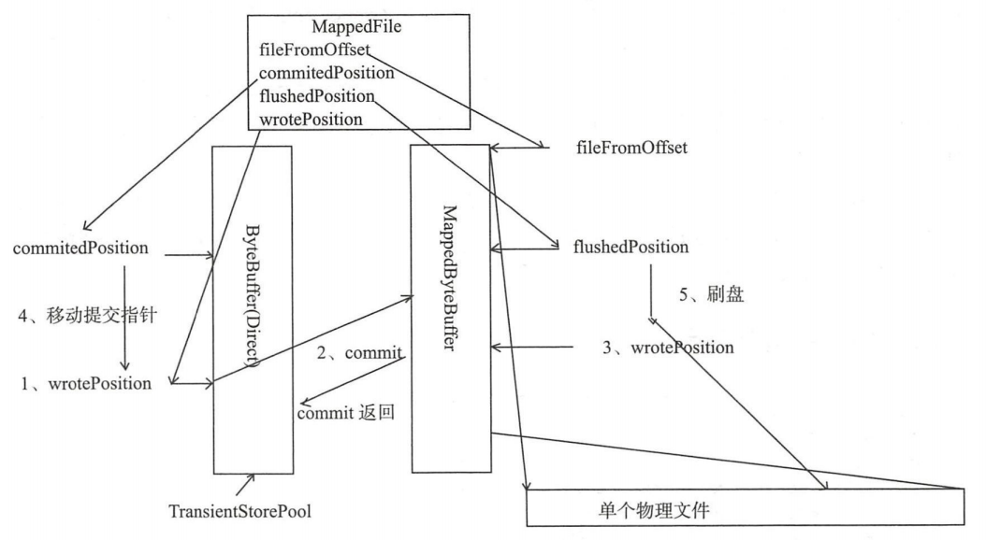

开启transientStorePoolEnable后异步刷盘步骤:

1. 将消息直接追加到ByteBuffer（堆外内存）
2. CommitRealTimeService线程每隔200ms将ByteBuffer新追加内容提交到MappedByteBuffer中
3. MappedByteBuffer在内存中追加提交的内容，wrotePosition指针向后移动
4. commit操作成功返回，将committedPosition位置恢复
5. FlushRealTimeService线程默认每500ms将MappedByteBuffer中新追加的内存刷写到磁盘

***代码：CommitLog$CommitRealTimeService#run***

提交线程工作机制

```java
//间隔时间,默认200ms
int interval = CommitLog.this.defaultMessageStore.getMessageStoreConfig().getCommitIntervalCommitLog();

//一次提交的至少页数
int commitDataLeastPages = CommitLog.this.defaultMessageStore.getMessageStoreConfig().getCommitCommitLogLeastPages();

//两次真实提交的最大间隔,默认200ms
int commitDataThoroughInterval =
CommitLog.this.defaultMessageStore.getMessageStoreConfig().getCommitCommitLogThoroughInterval();

//上次提交间隔超过commitDataThoroughInterval,则忽略提交commitDataThoroughInterval参数,直接提交
long begin = System.currentTimeMillis();
if (begin >= (this.lastCommitTimestamp + commitDataThoroughInterval)) {
    this.lastCommitTimestamp = begin;
    commitDataLeastPages = 0;
}

//执行提交操作,将待提交数据提交到物理文件的内存映射区
boolean result = CommitLog.this.mappedFileQueue.commit(commitDataLeastPages);
long end = System.currentTimeMillis();
if (!result) {
    this.lastCommitTimestamp = end; // result = false means some data committed.
    //now wake up flush thread.
    //唤醒刷盘线程
    flushCommitLogService.wakeup();
}

if (end - begin > 500) {
    log.info("Commit data to file costs {} ms", end - begin);
}
this.waitForRunning(interval);
```

***代码：CommitLog$FlushRealTimeService#run***

刷盘线程工作机制

```java
//表示await方法等待,默认false
boolean flushCommitLogTimed = CommitLog.this.defaultMessageStore.getMessageStoreConfig().isFlushCommitLogTimed();
//线程执行时间间隔
int interval = CommitLog.this.defaultMessageStore.getMessageStoreConfig().getFlushIntervalCommitLog();
//一次刷写任务至少包含页数
int flushPhysicQueueLeastPages = CommitLog.this.defaultMessageStore.getMessageStoreConfig().getFlushCommitLogLeastPages();
//两次真实刷写任务最大间隔
int flushPhysicQueueThoroughInterval =
CommitLog.this.defaultMessageStore.getMessageStoreConfig().getFlushCommitLogThoroughInterval();
...
//距离上次提交间隔超过flushPhysicQueueThoroughInterval,则本次刷盘任务将忽略flushPhysicQueueLeastPages,直接提交
long currentTimeMillis = System.currentTimeMillis();
if (currentTimeMillis >= (this.lastFlushTimestamp + flushPhysicQueueThoroughInterval)) {
    this.lastFlushTimestamp = currentTimeMillis;
    flushPhysicQueueLeastPages = 0;
    printFlushProgress = (printTimes++ % 10) == 0;
}
...
//执行一次刷盘前,先等待指定时间间隔
if (flushCommitLogTimed) {
    Thread.sleep(interval);
} else {
    this.waitForRunning(interval);
}
...
long begin = System.currentTimeMillis();
//刷写磁盘
CommitLog.this.mappedFileQueue.flush(flushPhysicQueueLeastPages);
long storeTimestamp = CommitLog.this.mappedFileQueue.getStoreTimestamp();
if (storeTimestamp > 0) {
//更新存储监测点文件的时间戳
CommitLog.this.defaultMessageStore.getStoreCheckpoint().setPhysicMsgTimestamp(storeTimestamp);

```

### 2.4.8 过期文件删除机制

由于RocketMQ操作CommitLog、ConsumerQueue文件是基于内存映射机制并在启动的时候回加载CommitLog、ConsumerQueue目录下的所有文件，为了避免内存与磁盘的浪费，不可能将消息永久存储在消息服务器上，所以要引入一种机制来删除已过期的文件。RocketMQ顺序写CommitLog、ConsumerQueue文件，所有写操作全部落在最后一个CommitLog或者ConsumerQueue文件上，之前的文件在下一个文件创建后将不会再被更新。RocketMQ清除过期文件的方法时：如果当前文件在在一定时间间隔内没有再次被消费，则认为是过期文件，可以被删除，RocketMQ不会关注这个文件上的消息是否全部被消费。默认每个文件的过期时间为72小时，通过在Broker配置文件中设置fileReservedTime来改变过期时间，单位为小时。

***代码：DefaultMessageStore#addScheduleTask***

```java
private void addScheduleTask() {
	//每隔10s调度一次清除文件
    this.scheduledExecutorService.scheduleAtFixedRate(new Runnable() {
        @Override
        public void run() {
            DefaultMessageStore.this.cleanFilesPeriodically();
        }
    }, 1000 * 60, this.messageStoreConfig.getCleanResourceInterval(), TimeUnit.MILLISECONDS);
	...
}
```

***代码：DefaultMessageStore#cleanFilesPeriodically***

```java
private void cleanFilesPeriodically() {
    //清除存储文件
    this.cleanCommitLogService.run();
    //清除消息消费队列文件
    this.cleanConsumeQueueService.run();
}
```

***代码：DefaultMessageStore#deleteExpiredFiles***

```java
private void deleteExpiredFiles() {
    //删除的数量
    int deleteCount = 0;
    //文件保留的时间
    long fileReservedTime = DefaultMessageStore.this.getMessageStoreConfig().getFileReservedTime();
    //删除物理文件的间隔
    int deletePhysicFilesInterval = DefaultMessageStore.this.getMessageStoreConfig().getDeleteCommitLogFilesInterval();
    //线程被占用,第一次拒绝删除后能保留的最大时间,超过该时间,文件将被强制删除
    int destroyMapedFileIntervalForcibly = DefaultMessageStore.this.getMessageStoreConfig().getDestroyMapedFileIntervalForcibly();

boolean timeup = this.isTimeToDelete();
boolean spacefull = this.isSpaceToDelete();
boolean manualDelete = this.manualDeleteFileSeveralTimes > 0;
if (timeup || spacefull || manualDelete) {
	...执行删除逻辑
}else{
    ...无作为
}
```

删除文件操作的条件

1. 指定删除文件的时间点，RocketMQ通过deleteWhen设置一天的固定时间执行一次删除过期文件操作，默认4点
2. 磁盘空间如果不充足，删除过期文件
3. 预留，手工触发。

***代码：CleanCommitLogService#isSpaceToDelete***

当磁盘空间不足时执行删除过期文件

```java
private boolean isSpaceToDelete() {
    //磁盘分区的最大使用量
    double ratio = DefaultMessageStore.this.getMessageStoreConfig().getDiskMaxUsedSpaceRatio() / 100.0;
	//是否需要立即执行删除过期文件操作
    cleanImmediately = false;

    {
        String storePathPhysic = DefaultMessageStore.this.getMessageStoreConfig().getStorePathCommitLog();
        //当前CommitLog目录所在的磁盘分区的磁盘使用率
        double physicRatio = UtilAll.getDiskPartitionSpaceUsedPercent(storePathPhysic);
        //diskSpaceWarningLevelRatio:磁盘使用率警告阈值,默认0.90
        if (physicRatio > diskSpaceWarningLevelRatio) {
            boolean diskok = DefaultMessageStore.this.runningFlags.getAndMakeDiskFull();
            if (diskok) {
                DefaultMessageStore.log.error("physic disk maybe full soon " + physicRatio + ", so mark disk full");
            }
			//diskSpaceCleanForciblyRatio:强制清除阈值,默认0.85
            cleanImmediately = true;
        } else if (physicRatio > diskSpaceCleanForciblyRatio) {
            cleanImmediately = true;
        } else {
            boolean diskok = DefaultMessageStore.this.runningFlags.getAndMakeDiskOK();
            if (!diskok) {
            DefaultMessageStore.log.info("physic disk space OK " + physicRatio + ", so mark disk ok");
        }
    }

    if (physicRatio < 0 || physicRatio > ratio) {
        DefaultMessageStore.log.info("physic disk maybe full soon, so reclaim space, " + physicRatio);
        return true;
    }
}
```

***代码：MappedFileQueue#deleteExpiredFileByTime***

执行文件销毁和删除

```java
for (int i = 0; i < mfsLength; i++) {
    //遍历每隔文件
    MappedFile mappedFile = (MappedFile) mfs[i];
    //计算文件存活时间
    long liveMaxTimestamp = mappedFile.getLastModifiedTimestamp() + expiredTime;
    //如果超过72小时,执行文件删除
    if (System.currentTimeMillis() >= liveMaxTimestamp || cleanImmediately) {
        if (mappedFile.destroy(intervalForcibly)) {
            files.add(mappedFile);
            deleteCount++;

            if (files.size() >= DELETE_FILES_BATCH_MAX) {
                break;
            }

            if (deleteFilesInterval > 0 && (i + 1) < mfsLength) {
                try {
                    Thread.sleep(deleteFilesInterval);
                } catch (InterruptedException e) {
                }
            }
        } else {
            break;
        }
    } else {
        //avoid deleting files in the middle
        break;
    }
}
```

### 2.4.9 小结

RocketMQ的存储文件包括消息文件（Commitlog）、消息消费队列文件（ConsumerQueue）、Hash索引文件（IndexFile）、监测点文件（checkPoint）、abort（关闭异常文件）。单个消息存储文件、消息消费队列文件、Hash索引文件长度固定以便使用内存映射机制进行文件的读写操作。RocketMQ组织文件以文件的起始偏移量来命令文件，这样根据偏移量能快速定位到真实的物理文件。RocketMQ基于内存映射文件机制提供了同步刷盘和异步刷盘两种机制，异步刷盘是指在消息存储时先追加到内存映射文件，然后启动专门的刷盘线程定时将内存中的文件数据刷写到磁盘。

CommitLog，消息存储文件，RocketMQ为了保证消息发送的高吞吐量，采用单一文件存储所有主题消息，保证消息存储是完全的顺序写，但这样给文件读取带来了不便，为此RocketMQ为了方便消息消费构建了消息消费队列文件，基于主题与队列进行组织，同时RocketMQ为消息实现了Hash索引，可以为消息设置索引键，根据所以能够快速从CommitLog文件中检索消息。

当消息达到CommitLog后，会通过ReputMessageService线程接近实时地将消息转发给消息消费队列文件与索引文件。为了安全起见，RocketMQ引入abort文件，记录Broker的停机是否是正常关闭还是异常关闭，在重启Broker时为了保证CommitLog文件，消息消费队列文件与Hash索引文件的正确性，分别采用不同策略来恢复文件。

RocketMQ不会永久存储消息文件、消息消费队列文件，而是启动文件过期机制并在磁盘空间不足或者默认凌晨4点删除过期文件，文件保存72小时并且在删除文件时并不会判断该消息文件上的消息是否被消费。

## 2.5 Consumer

### 2.5.1 消息消费概述

消息消费以组的模式开展，一个消费组内可以包含多个消费者，每一个消费者组可订阅多个主题，消费组之间有ff式和广播模式两种消费模式。集群模式，主题下的同一条消息只允许被其中一个消费者消费。广播模式，主题下的同一条消息，将被集群内的所有消费者消费一次。消息服务器与消费者之间的消息传递也有两种模式：推模式、拉模式。所谓的拉模式，是消费端主动拉起拉消息请求，而推模式是消息达到消息服务器后，推送给消息消费者。RocketMQ消息推模式的实现基于拉模式，在拉模式上包装一层，一个拉取任务完成后开始下一个拉取任务。

集群模式下，多个消费者如何对消息队列进行负载呢？消息队列负载机制遵循一个通用思想：一个消息队列同一个时间只允许被一个消费者消费，一个消费者可以消费多个消息队列。

RocketMQ支持局部顺序消息消费，也就是保证同一个消息队列上的消息顺序消费。不支持消息全局顺序消费，如果要实现某一个主题的全局顺序消费，可以将该主题的队列数设置为1，牺牲高可用性。

###2.5.2 消息消费初探

**<u>消息推送模式</u>**

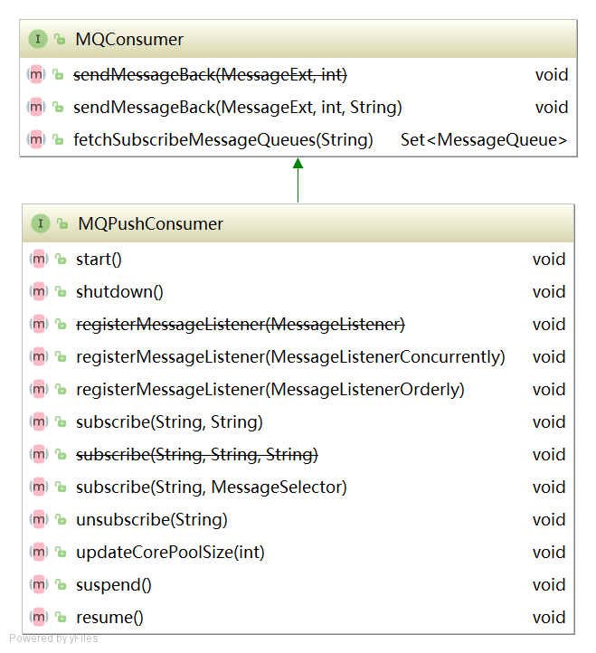

**<u>消息消费重要方法</u>**

```java
void sendMessageBack(final MessageExt msg, final int delayLevel, final String brokerName)：发送消息确认
Set<MessageQueue> fetchSubscribeMessageQueues(final String topic) :获取消费者对主题分配了那些消息队列
void registerMessageListener(final MessageListenerConcurrently messageListener)：注册并发事件监听器
void registerMessageListener(final MessageListenerOrderly messageListener)：注册顺序消息事件监听器
void subscribe(final String topic, final String subExpression)：基于主题订阅消息，消息过滤使用表达式
void subscribe(final String topic, final String fullClassName,final String filterClassSource)：基于主题订阅消息，消息过滤使用类模式
void subscribe(final String topic, final MessageSelector selector) ：订阅消息，并指定队列选择器
void unsubscribe(final String topic)：取消消息订阅
```

**<u>DefaultMQPushConsumer</u>**

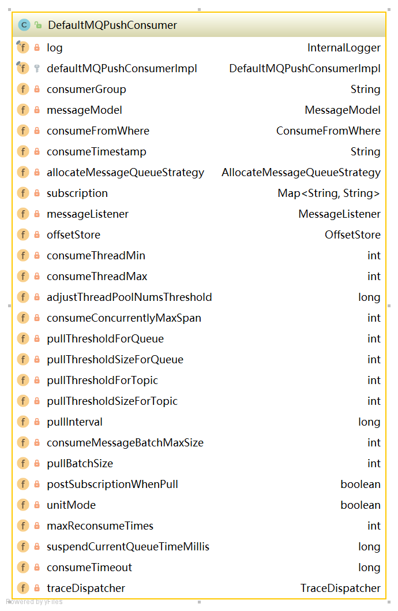

```java
//消费者组
private String consumerGroup;	
//消息消费模式
private MessageModel messageModel = MessageModel.CLUSTERING;	
//指定消费开始偏移量（最大偏移量、最小偏移量、启动时间戳）开始消费
private ConsumeFromWhere consumeFromWhere = ConsumeFromWhere.CONSUME_FROM_LAST_OFFSET;
//集群模式下的消息队列负载策略
private AllocateMessageQueueStrategy allocateMessageQueueStrategy;
//订阅信息
private Map<String /* topic */, String /* sub expression */> subscription = new HashMap<String, String>();
//消息业务监听器
private MessageListener messageListener;
//消息消费进度存储器
private OffsetStore offsetStore;
//消费者最小线程数量
private int consumeThreadMin = 20;
//消费者最大线程数量
private int consumeThreadMax = 20;
//并发消息消费时处理队列最大跨度
private int consumeConcurrentlyMaxSpan = 2000;
//每1000次流控后打印流控日志
private int pullThresholdForQueue = 1000;
//推模式下任务间隔时间
private long pullInterval = 0;
//推模式下任务拉取的条数,默认32条
private int pullBatchSize = 32;
//每次传入MessageListener#consumerMessage中消息的数量
private int consumeMessageBatchMaxSize = 1;
//是否每次拉取消息都订阅消息
private boolean postSubscriptionWhenPull = false;
//消息重试次数,-1代表16次
private int maxReconsumeTimes = -1;
//消息消费超时时间
private long consumeTimeout = 15;
```

### 2.5.3 消费者启动流程

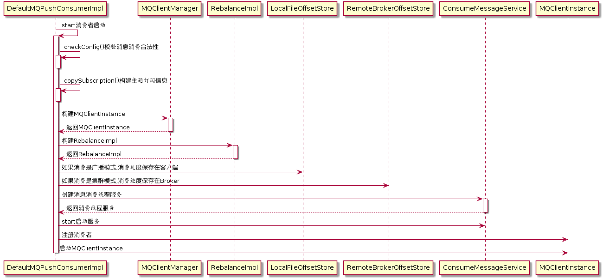

***代码：DefaultMQPushConsumerImpl#start***

```java
public synchronized void start() throws MQClientException {
    switch (this.serviceState) {
        case CREATE_JUST:
            
                this.defaultMQPushConsumer.getMessageModel(), this.defaultMQPushConsumer.isUnitMode());
            this.serviceState = ServiceState.START_FAILED;
			//检查消息者是否合法
            this.checkConfig();
			//构建主题订阅信息
            this.copySubscription();
			//设置消费者客户端实例名称为进程ID
            if (this.defaultMQPushConsumer.getMessageModel() == MessageModel.CLUSTERING) {
                this.defaultMQPushConsumer.changeInstanceNameToPID();
            }
			//创建MQClient实例
            this.mQClientFactory = MQClientManager.getInstance().getAndCreateMQClientInstance(this.defaultMQPushConsumer, this.rpcHook);
			//构建rebalanceImpl
            this.rebalanceImpl.setConsumerGroup(this.defaultMQPushConsumer.getConsumerGroup());
            this.rebalanceImpl.setMessageModel(this.defaultMQPushConsumer.getMessageModel());
            this.rebalanceImpl.setAllocateMessageQueueStrategy(this.defaultMQPushConsumer.getAllocateMessageQueueStrategy());
            this.rebalanceImpl.setmQClientFactory(this.mQClientFactor
            this.pullAPIWrapper = new PullAPIWrapper(
                mQClientFactory,
                this.defaultMQPushConsumer.getConsumerGroup(), isUnitMode());
            this.pullAPIWrapper.registerFilterMessageHook(filterMessageHookLis
            if (this.defaultMQPushConsumer.getOffsetStore() != null) {
                this.offsetStore = this.defaultMQPushConsumer.getOffsetStore();
            } else {
           		switch (this.defaultMQPushConsumer.getMessageModel()) {
               
           	    case BROADCASTING:	 //消息消费广播模式,将消费进度保存在本地
           	        this.offsetStore = new LocalFileOffsetStore(this.mQClientFactory, this.defaultMQPushConsumer.getConsumerGroup());
           	            break;
           	        case CLUSTERING:	//消息消费集群模式,将消费进度保存在远端Broker
           	            this.offsetStore = new RemoteBrokerOffsetStore(this.mQClientFactory, this.defaultMQPushConsumer.getConsumerGroup());
           	            break;
           	        default:
           	            break;
           	    }
           	    this.defaultMQPushConsumer.setOffsetStore(this.offsetStore);
           	}
            this.offsetStore.load
            //创建顺序消息消费服务
            if (this.getMessageListenerInner() instanceof MessageListenerOrderly) {
                this.consumeOrderly = true;
                this.consumeMessageService =
                    new ConsumeMessageOrderlyService(this, (MessageListenerOrderly) this.getMessageListenerInner());
                //创建并发消息消费服务
            } else if (this.getMessageListenerInner() instanceof MessageListenerConcurrently) {
                this.consumeOrderly = false;
                this.consumeMessageService =
                    new ConsumeMessageConcurrentlyService(this, (MessageListenerConcurrently) this.getMessageListenerInner());
            }
            //消息消费服务启动
            this.consumeMessageService.start();
            //注册消费者实例
            boolean registerOK = mQClientFactory.registerConsumer(this.defaultMQPushConsumer.getConsumerGroup(), this);
            
            if (!registerOK) {
                this.serviceState = ServiceState.CREATE_JUST;
                this.consumeMessageService.shutdown();
                throw new MQClientException("The consumer group[" + this.defaultMQPushConsumer.getConsumerGroup()
                    + "] has been created before, specify another name please." + FAQUrl.suggestTodo(FAQUrl.GROUP_NAME_DUPLICATE_URL),
                    null);
            //启动消费者客户端
            mQClientFactory.start();
            log.info("the consumer [{}] start OK.", this.defaultMQPushConsumer.getConsumerGroup());
            this.serviceState = ServiceState.RUNNING;
            break;
            case RUNNING:
            case START_FAILED:
        case SHUTDOWN_ALREADY:
            throw new MQClientException("The PushConsumer service state not OK, maybe started once, "
                + this.serviceState
                + FAQUrl.suggestTodo(FAQUrl.CLIENT_SERVICE_NOT_OK),
                null);
        default:
            break;
    }

    this.updateTopicSubscribeInfoWhenSubscriptionChanged();
    this.mQClientFactory.checkClientInBroker();
    this.mQClientFactory.sendHeartbeatToAllBrokerWithLock();
    this.mQClientFactory.rebalanceImmediately();
}
```

### 2.5.4 消息拉取

消息消费模式有两种模式：广播模式与集群模式。广播模式比较简单，每一个消费者需要拉取订阅主题下所有队列的消息。本文重点讲解集群模式。在集群模式下，同一个消费者组内有多个消息消费者，同一个主题存在多个消费队列，消费者通过负载均衡的方式消费消息。

消息队列负载均衡，通常的作法是一个消息队列在同一个时间只允许被一个消费消费者消费，一个消息消费者可以同时消费多个消息队列。

#### 1）PullMessageService实现机制

从MQClientInstance的启动流程中可以看出，RocketMQ使用一个单独的线程PullMessageService来负责消息的拉取。


***代码：PullMessageService#run***

```java
public void run() {
    log.info(this.getServiceName() + " service started");
	//循环拉取消息
    while (!this.isStopped()) {
        try {
            //从请求队列中获取拉取消息请求
            PullRequest pullRequest = this.pullRequestQueue.take();
            //拉取消息
            this.pullMessage(pullRequest);
        } catch (InterruptedException ignored) {
        } catch (Exception e) {
            log.error("Pull Message Service Run Method exception", e);
        }
    }

    log.info(this.getServiceName() + " service end");
}
```

<u>**PullRequest**</u>


```java
private String consumerGroup;	//消费者组
private MessageQueue messageQueue;	//待拉取消息队列
private ProcessQueue processQueue;	//消息处理队列
private long nextOffset;	//待拉取的MessageQueue偏移量
private boolean lockedFirst = false;	//是否被锁定
```

***代码：PullMessageService#pullMessage***

```java
private void pullMessage(final PullRequest pullRequest) {
    //获得消费者实例
    final MQConsumerInner consumer = this.mQClientFactory.selectConsumer(pullRequest.getConsumerGroup());
    if (consumer != null) {
        //强转为推送模式消费者
        DefaultMQPushConsumerImpl impl = (DefaultMQPushConsumerImpl) consumer;
        //推送消息
        impl.pullMessage(pullRequest);
    } else {
        log.warn("No matched consumer for the PullRequest {}, drop it", pullRequest);
    }
}
```

####2）ProcessQueue实现机制

ProcessQueue是MessageQueue在消费端的重现、快照。PullMessageService从消息服务器默认每次拉取32条消息，按照消息的队列偏移量顺序存放在ProcessQueue中，PullMessageService然后将消息提交到消费者消费线程池，消息成功消费后从ProcessQueue中移除。

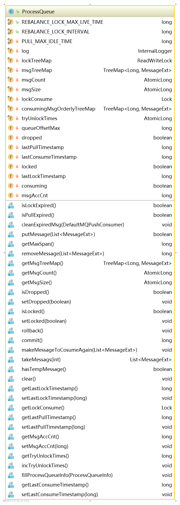

**<u>属性</u>**

```java
//消息容器
private final TreeMap<Long, MessageExt> msgTreeMap = new TreeMap<Long, MessageExt>();
//读写锁
private final ReadWriteLock lockTreeMap = new ReentrantReadWriteLock();
//ProcessQueue总消息树
private final AtomicLong msgCount = new AtomicLong();
//ProcessQueue队列最大偏移量
private volatile long queueOffsetMax = 0L;
//当前ProcessQueue是否被丢弃
private volatile boolean dropped = false;
//上一次拉取时间戳
private volatile long lastPullTimestamp = System.currentTimeMillis();
//上一次消费时间戳
private volatile long lastConsumeTimestamp = System.currentTimeMillis();
```

**<u>方法</u>**

```java
//移除消费超时消息
public void cleanExpiredMsg(DefaultMQPushConsumer pushConsumer)
//添加消息
public boolean putMessage(final List<MessageExt> msgs)
//获取消息最大间隔
public long getMaxSpan()
//移除消息
public long removeMessage(final List<MessageExt> msgs)
//将consumingMsgOrderlyTreeMap中消息重新放在msgTreeMap,并清空consumingMsgOrderlyTreeMap   
public void rollback() 
//将consumingMsgOrderlyTreeMap消息清除,表示成功处理该批消息
public long commit()
//重新处理该批消息
public void makeMessageToCosumeAgain(List<MessageExt> msgs) 
//从processQueue中取出batchSize条消息
public List<MessageExt> takeMessags(final int batchSize)
```

#### 3）消息拉取基本流程

#####1.客户端发起拉取请求

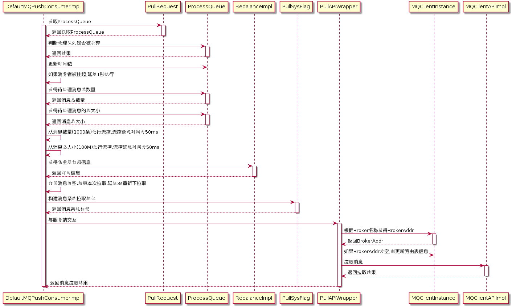

***代码：DefaultMQPushConsumerImpl#pullMessage***

```java
public void pullMessage(final PullRequest pullRequest) {
    //从pullRequest获得ProcessQueue
    final ProcessQueue processQueue = pullRequest.getProcessQueue();
    //如果处理队列被丢弃,直接返回
    if (processQueue.isDropped()) {
        log.info("the pull request[{}] is dropped.", pullRequest.toString());
        return;
    }
	//如果处理队列未被丢弃,更新时间戳
    pullRequest.getProcessQueue().setLastPullTimestamp(System.currentTimeMillis());

    try {
        this.makeSureStateOK();
    } catch (MQClientException e) {
        log.warn("pullMessage exception, consumer state not ok", e);
        this.executePullRequestLater(pullRequest, PULL_TIME_DELAY_MILLS_WHEN_EXCEPTION);
        return;
    }
	//如果处理队列被挂起,延迟1s后再执行
    if (this.isPause()) {
        log.warn("consumer was paused, execute pull request later. instanceName={}, group={}", this.defaultMQPushConsumer.getInstanceName(), this.defaultMQPushConsumer.getConsumerGroup());
        this.executePullRequestLater(pullRequest, PULL_TIME_DELAY_MILLS_WHEN_SUSPEND);
        return;
    }
	//获得最大待处理消息数量
	long cachedMessageCount = processQueue.getMsgCount().get();
    //获得最大待处理消息大小
	long cachedMessageSizeInMiB = processQueue.getMsgSize().get() / (1024 * 1024);
	//从数量进行流控
	if (cachedMessageCount > this.defaultMQPushConsumer.getPullThresholdForQueue()) {
	    this.executePullRequestLater(pullRequest, PULL_TIME_DELAY_MILLS_WHEN_FLOW_CONTROL);
	    if ((queueFlowControlTimes++ % 1000) == 0) {
	        log.warn(
	            "the cached message count exceeds the threshold {}, so do flow control, minOffset={}, maxOffset={}, count={}, size={} MiB, pullRequest={}, flowControlTimes={}",
	            this.defaultMQPushConsumer.getPullThresholdForQueue(), processQueue.getMsgTreeMap().firstKey(), processQueue.getMsgTreeMap().lastKey(), cachedMessageCount, cachedMessageSizeInMiB, pullRequest, queueFlowControlTimes);
	    }
	    return;
	}
	//从消息大小进行流控
	if (cachedMessageSizeInMiB > this.defaultMQPushConsumer.getPullThresholdSizeForQueue()) {
	    this.executePullRequestLater(pullRequest, PULL_TIME_DELAY_MILLS_WHEN_FLOW_CONTROL);
	    if ((queueFlowControlTimes++ % 1000) == 0) {
	        log.warn(
	            "the cached message size exceeds the threshold {} MiB, so do flow control, minOffset={}, maxOffset={}, count={}, size={} MiB, pullRequest={}, flowControlTimes={}",
	            this.defaultMQPushConsumer.getPullThresholdSizeForQueue(), processQueue.getMsgTreeMap().firstKey(), processQueue.getMsgTreeMap().lastKey(), cachedMessageCount, cachedMessageSizeInMiB, pullRequest, queueFlowControlTimes);
	    }
	    return;
    }
    	//获得订阅信息
		 final SubscriptionData subscriptionData = this.rebalanceImpl.getSubscriptionInner().get(pullRequest.getMessageQueue().getTopic());
    	if (null == subscriptionData) {
    	    this.executePullRequestLater(pullRequest, PULL_TIME_DELAY_MILLS_WHEN_EXCEPTION);
    	    log.warn("find the consumer's subscription failed, {}", pullRequest);
    	    return;
		//与服务端交互,获取消息
	    this.pullAPIWrapper.pullKernelImpl(
	    pullRequest.getMessageQueue(),
	    subExpression,
	    subscriptionData.getExpressionType(),
	    subscriptionData.getSubVersion(),
	    pullRequest.getNextOffset(),
	    this.defaultMQPushConsumer.getPullBatchSize(),
	    sysFlag,
	    commitOffsetValue,
	    BROKER_SUSPEND_MAX_TIME_MILLIS,
	    CONSUMER_TIMEOUT_MILLIS_WHEN_SUSPEND,
	    CommunicationMode.ASYNC,
	    pullCallback
	);
            
}
```

#####2.消息服务端Broker组装消息


***代码：PullMessageProcessor#processRequest***

```java
//构建消息过滤器
MessageFilter messageFilter;
if (this.brokerController.getBrokerConfig().isFilterSupportRetry()) {
    messageFilter = new ExpressionForRetryMessageFilter(subscriptionData, consumerFilterData,
        this.brokerController.getConsumerFilterManager());
} else {
    messageFilter = new ExpressionMessageFilter(subscriptionData, consumerFilterData,
        this.brokerController.getConsumerFilterManager());
}
//调用MessageStore.getMessage查找消息
final GetMessageResult getMessageResult =
    this.brokerController.getMessageStore().getMessage(
    				requestHeader.getConsumerGroup(), //消费组名称								
    				requestHeader.getTopic(),	//主题名称
        			requestHeader.getQueueId(), //队列ID
    				requestHeader.getQueueOffset(), 	//待拉取偏移量
    				requestHeader.getMaxMsgNums(), 	//最大拉取消息条数
    				messageFilter	//消息过滤器
    		);
```

***代码：DefaultMessageStore#getMessage***

```java
GetMessageStatus status = GetMessageStatus.NO_MESSAGE_IN_QUEUE;
long nextBeginOffset = offset;	//查找下一次队列偏移量
long minOffset = 0;		//当前消息队列最小偏移量
long maxOffset = 0;		//当前消息队列最大偏移量
GetMessageResult getResult = new GetMessageResult();
final long maxOffsetPy = this.commitLog.getMaxOffset();	//当前commitLog最大偏移量
//根据主题名称和队列编号获取消息消费队列
ConsumeQueue consumeQueue = findConsumeQueue(topic, queueId);

...
minOffset = consumeQueue.getMinOffsetInQueue();
maxOffset = consumeQueue.getMaxOffsetInQueue();
//消息偏移量异常情况校对下一次拉取偏移量
if (maxOffset == 0) {	//表示当前消息队列中没有消息
    status = GetMessageStatus.NO_MESSAGE_IN_QUEUE;
    nextBeginOffset = nextOffsetCorrection(offset, 0);
} else if (offset < minOffset) {	//待拉取消息的偏移量小于队列的其实偏移量
    status = GetMessageStatus.OFFSET_TOO_SMALL;
    nextBeginOffset = nextOffsetCorrection(offset, minOffset);
} else if (offset == maxOffset) {	//待拉取偏移量为队列最大偏移量
    status = GetMessageStatus.OFFSET_OVERFLOW_ONE;
    nextBeginOffset = nextOffsetCorrection(offset, offset);
} else if (offset > maxOffset) {	//偏移量越界
    status = GetMessageStatus.OFFSET_OVERFLOW_BADLY;
    if (0 == minOffset) {
        nextBeginOffset = nextOffsetCorrection(offset, minOffset);
    } else {
        nextBeginOffset = nextOffsetCorrection(offset, maxOffset);
    }
}
...
//根据偏移量从CommitLog中拉取32条消息
SelectMappedBufferResult selectResult = this.commitLog.getMessage(offsetPy, sizePy);
```

***代码：PullMessageProcessor#processRequest***

```java
//根据拉取结果填充responseHeader
response.setRemark(getMessageResult.getStatus().name());
responseHeader.setNextBeginOffset(getMessageResult.getNextBeginOffset());
responseHeader.setMinOffset(getMessageResult.getMinOffset());
responseHeader.setMaxOffset(getMessageResult.getMaxOffset());

//判断如果存在主从同步慢,设置下一次拉取任务的ID为主节点
switch (this.brokerController.getMessageStoreConfig().getBrokerRole()) {
    case ASYNC_MASTER:
    case SYNC_MASTER:
        break;
    case SLAVE:
        if (!this.brokerController.getBrokerConfig().isSlaveReadEnable()) {
            response.setCode(ResponseCode.PULL_RETRY_IMMEDIATELY);
            responseHeader.setSuggestWhichBrokerId(MixAll.MASTER_ID);
        }
        break;
}
...
//GetMessageResult与Response的Code转换
switch (getMessageResult.getStatus()) {
    case FOUND:			//成功
        response.setCode(ResponseCode.SUCCESS);
        break;
    case MESSAGE_WAS_REMOVING:	//消息存放在下一个commitLog中
        response.setCode(ResponseCode.PULL_RETRY_IMMEDIATELY);	//消息重试
        break;
    case NO_MATCHED_LOGIC_QUEUE:	//未找到队列
    case NO_MESSAGE_IN_QUEUE:	//队列中未包含消息
        if (0 != requestHeader.getQueueOffset()) {
            response.setCode(ResponseCode.PULL_OFFSET_MOVED);
            requestHeader.getQueueOffset(),
            getMessageResult.getNextBeginOffset(),
            requestHeader.getTopic(),
            requestHeader.getQueueId(),
            requestHeader.getConsumerGroup()
            );
        } else {
            response.setCode(ResponseCode.PULL_NOT_FOUND);
        }
        break;
    case NO_MATCHED_MESSAGE:	//未找到消息
        response.setCode(ResponseCode.PULL_RETRY_IMMEDIATELY);
        break;
    case OFFSET_FOUND_NULL:	//消息物理偏移量为空
        response.setCode(ResponseCode.PULL_NOT_FOUND);
        break;
    case OFFSET_OVERFLOW_BADLY:	//offset越界
        response.setCode(ResponseCode.PULL_OFFSET_MOVED);
        // XXX: warn and notify me
        log.info("the request offset: {} over flow badly, broker max offset: {}, consumer: {}",
                requestHeader.getQueueOffset(), getMessageResult.getMaxOffset(), channel.remoteAddress());
        break;
    case OFFSET_OVERFLOW_ONE:	//offset在队列中未找到
        response.setCode(ResponseCode.PULL_NOT_FOUND);
        break;
    case OFFSET_TOO_SMALL:	//offset未在队列中
        response.setCode(ResponseCode.PULL_OFFSET_MOVED);
        requestHeader.getConsumerGroup(), 
        requestHeader.getTopic(), 
        requestHeader.getQueueOffset(),
        getMessageResult.getMinOffset(), channel.remoteAddress());
        break;
    default:
        assert false;
        break;
}
...
//如果CommitLog标记可用,并且当前Broker为主节点,则更新消息消费进度
boolean storeOffsetEnable = brokerAllowSuspend;
storeOffsetEnable = storeOffsetEnable && hasCommitOffsetFlag;
storeOffsetEnable = storeOffsetEnable
    && this.brokerController.getMessageStoreConfig().getBrokerRole() != BrokerRole.SLAVE;
if (storeOffsetEnable) {
    this.brokerController.getConsumerOffsetManager().commitOffset(RemotingHelper.parseChannelRemoteAddr(channel),
        requestHeader.getConsumerGroup(), requestHeader.getTopic(), requestHeader.getQueueId(), requestHeader.getCommitOffset());
}
```

#####3.消息拉取客户端处理消息

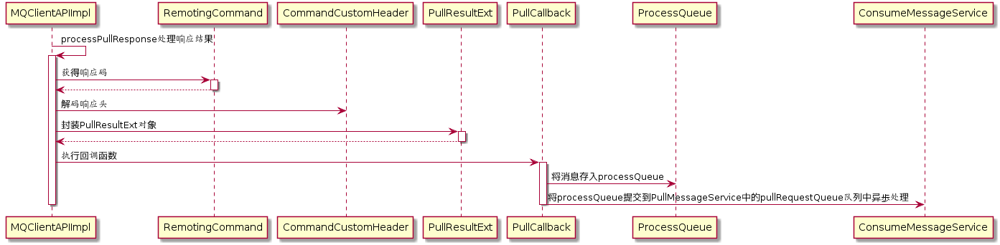

***代码：MQClientAPIImpl#processPullResponse***

```java
private PullResult processPullResponse(
    final RemotingCommand response) throws MQBrokerException, RemotingCommandException {
    PullStatus pullStatus = PullStatus.NO_NEW_MSG;
   	//判断响应结果
    switch (response.getCode()) {
        case ResponseCode.SUCCESS:
            pullStatus = PullStatus.FOUND;
            break;
        case ResponseCode.PULL_NOT_FOUND:
            pullStatus = PullStatus.NO_NEW_MSG;
            break;
        case ResponseCode.PULL_RETRY_IMMEDIATELY:
            pullStatus = PullStatus.NO_MATCHED_MSG;
            break;
        case ResponseCode.PULL_OFFSET_MOVED:
            pullStatus = PullStatus.OFFSET_ILLEGAL;
            break;

        default:
            throw new MQBrokerException(response.getCode(), response.getRemark());
    }
	//解码响应头
    PullMessageResponseHeader responseHeader =
        (PullMessageResponseHeader) response.decodeCommandCustomHeader(PullMessageResponseHeader.class);
	//封装PullResultExt返回
    return new PullResultExt(pullStatus, responseHeader.getNextBeginOffset(), responseHeader.getMinOffset(),
        responseHeader.getMaxOffset(), null, responseHeader.getSuggestWhichBrokerId(), response.getBody());
}
```

<u>**PullResult类**</u>

```java
private final PullStatus pullStatus;	//拉取结果
private final long nextBeginOffset;	//下次拉取偏移量
private final long minOffset;	//消息队列最小偏移量
private final long maxOffset;	//消息队列最大偏移量
private List<MessageExt> msgFoundList;	//拉取的消息列表
```

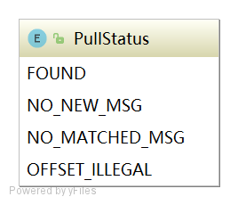

***代码：DefaultMQPushConsumerImpl$PullCallback#OnSuccess***

```java
//将拉取到的消息存入processQueue
boolean dispatchToConsume = processQueue.putMessage(pullResult.getMsgFoundList());
//将processQueue提交到consumeMessageService中供消费者消费
DefaultMQPushConsumerImpl.this.consumeMessageService.submitConsumeRequest(
    pullResult.getMsgFoundList(),
    processQueue,
    pullRequest.getMessageQueue(),
    dispatchToConsume);
//如果pullInterval大于0,则等待pullInterval毫秒后将pullRequest对象放入到PullMessageService中的pullRequestQueue队列中
if (DefaultMQPushConsumerImpl.this.defaultMQPushConsumer.getPullInterval() > 0) {
    DefaultMQPushConsumerImpl.this.executePullRequestLater(pullRequest,
        DefaultMQPushConsumerImpl.this.defaultMQPushConsumer.getPullInterval());
} else {
    DefaultMQPushConsumerImpl.this.executePullRequestImmediately(pullRequest);
}
```

##### 4.消息拉取总结


#### 4）消息拉取长轮询机制分析

RocketMQ未真正实现消息推模式，而是消费者主动向消息服务器拉取消息，RocketMQ推模式是循环向消息服务端发起消息拉取请求，如果消息消费者向RocketMQ拉取消息时，消息未到达消费队列时，如果不启用长轮询机制，则会在服务端等待shortPollingTimeMills时间后（挂起）再去判断消息是否已经到达指定消息队列，如果消息仍未到达则提示拉取消息客户端PULL—NOT—FOUND（消息不存在）；如果开启长轮询模式，RocketMQ一方面会每隔5s轮询检查一次消息是否可达，同时一有消息达到后立马通知挂起线程再次验证消息是否是自己感兴趣的消息，如果是则从CommitLog文件中提取消息返回给消息拉取客户端，否则直到挂起超时，超时时间由消息拉取方在消息拉取是封装在请求参数中，PUSH模式为15s，PULL模式通过DefaultMQPullConsumer#setBrokerSuspendMaxTimeMillis设置。RocketMQ通过在Broker客户端配置longPollingEnable为true来开启长轮询模式。

***代码：PullMessageProcessor#processRequest***

```java
//当没有拉取到消息时，通过长轮询方式继续拉取消息
case ResponseCode.PULL_NOT_FOUND:
    if (brokerAllowSuspend && hasSuspendFlag) {
        long pollingTimeMills = suspendTimeoutMillisLong;
        if (!this.brokerController.getBrokerConfig().isLongPollingEnable()) {
            pollingTimeMills = this.brokerController.getBrokerConfig().getShortPollingTimeMills();
        }

        String topic = requestHeader.getTopic();
        long offset = requestHeader.getQueueOffset();
        int queueId = requestHeader.getQueueId();
        //构建拉取请求对象
        PullRequest pullRequest = new PullRequest(request, channel, pollingTimeMills,
            this.brokerController.getMessageStore().now(), offset, subscriptionData, messageFilter);
        //处理拉取请求
        this.brokerController.getPullRequestHoldService().suspendPullRequest(topic, queueId, pullRequest);
        response = null;
        break;
    }
```

**<u>PullRequestHoldService方式实现长轮询</u>**

***代码：PullRequestHoldService#suspendPullRequest***

```java
//将拉取消息请求，放置在ManyPullRequest集合中
public void suspendPullRequest(final String topic, final int queueId, final PullRequest pullRequest) {
    String key = this.buildKey(topic, queueId);
    ManyPullRequest mpr = this.pullRequestTable.get(key);
    if (null == mpr) {
        mpr = new ManyPullRequest();
        ManyPullRequest prev = this.pullRequestTable.putIfAbsent(key, mpr);
        if (prev != null) {
            mpr = prev;
        }
    }

    mpr.addPullRequest(pullRequest);
}
```

***代码：PullRequestHoldService#run***

```java
public void run() {
    log.info("{} service started", this.getServiceName());
    while (!this.isStopped()) {
        try {
            //如果开启长轮询每隔5秒判断消息是否到达
            if (this.brokerController.getBrokerConfig().isLongPollingEnable()) {
                this.waitForRunning(5 * 1000);
            } else {
                //没有开启长轮询,每隔1s再次尝试
              this.waitForRunning(this.brokerController.getBrokerConfig().getShortPollingTimeMills());
            }

            long beginLockTimestamp = this.systemClock.now();
            this.checkHoldRequest();
            long costTime = this.systemClock.now() - beginLockTimestamp;
            if (costTime > 5 * 1000) {
                log.info("[NOTIFYME] check hold request cost {} ms.", costTime);
            }
        } catch (Throwable e) {
            log.warn(this.getServiceName() + " service has exception. ", e);
        }
    }

    log.info("{} service end", this.getServiceName());
}
```

***代码：PullRequestHoldService#checkHoldRequest***

```java
//遍历拉取任务
private void checkHoldRequest() {
    for (String key : this.pullRequestTable.keySet()) {
        String[] kArray = key.split(TOPIC_QUEUEID_SEPARATOR);
        if (2 == kArray.length) {
            String topic = kArray[0];
            int queueId = Integer.parseInt(kArray[1]);
            //获得消息偏移量
            final long offset = this.brokerController.getMessageStore().getMaxOffsetInQueue(topic, queueId);
            try {
                //通知有消息达到
                this.notifyMessageArriving(topic, queueId, offset);
            } catch (Throwable e) {
                log.error("check hold request failed. topic={}, queueId={}", topic, queueId, e);
            }
        }
    }
}
```

***代码：PullRequestHoldService#notifyMessageArriving***

```java
//如果拉取消息偏移大于请求偏移量,如果消息匹配调用executeRequestWhenWakeup处理消息
if (newestOffset > request.getPullFromThisOffset()) {
    boolean match = request.getMessageFilter().isMatchedByConsumeQueue(tagsCode,
        new ConsumeQueueExt.CqExtUnit(tagsCode, msgStoreTime, filterBitMap));
    // match by bit map, need eval again when properties is not null.
    if (match && properties != null) {
        match = request.getMessageFilter().isMatchedByCommitLog(null, properties);
    }

    if (match) {
        try {
            this.brokerController.getPullMessageProcessor().executeRequestWhenWakeup(request.getClientChannel(),
                request.getRequestCommand());
        } catch (Throwable e) {
            log.error("execute request when wakeup failed.", e);
        }
        continue;
    }
}
//如果过期时间超时,则不继续等待将直接返回给客户端消息未找到
if (System.currentTimeMillis() >= (request.getSuspendTimestamp() + request.getTimeoutMillis())) {
    try {
        this.brokerController.getPullMessageProcessor().executeRequestWhenWakeup(request.getClientChannel(),
            request.getRequestCommand());
    } catch (Throwable e) {
        log.error("execute request when wakeup failed.", e);
    }
    continue;
}
```

如果开启了长轮询机制，PullRequestHoldService会每隔5s被唤醒去尝试检测是否有新的消息的到来才给客户端响应，或者直到超时才给客户端进行响应，消息实时性比较差，为了避免这种情况，RocketMQ引入另外一种机制：当消息到达时唤醒挂起线程触发一次检查。

**<u>DefaultMessageStore$ReputMessageService机制</u>**

***代码：DefaultMessageStore#start***

```java
//长轮询入口
this.reputMessageService.setReputFromOffset(maxPhysicalPosInLogicQueue);
this.reputMessageService.start();
```

***代码：DefaultMessageStore$ReputMessageService#run***

```java
public void run() {
    DefaultMessageStore.log.info(this.getServiceName() + " service started");

    while (!this.isStopped()) {
        try {
            Thread.sleep(1);
            //长轮询核心逻辑代码入口
            this.doReput();
        } catch (Exception e) {
            DefaultMessageStore.log.warn(this.getServiceName() + " service has exception. ", e);
        }
    }

    DefaultMessageStore.log.info(this.getServiceName() + " service end");
}
```

***代码：DefaultMessageStore$ReputMessageService#deReput***

```java
//当新消息达到是,进行通知监听器进行处理
if (BrokerRole.SLAVE != DefaultMessageStore.this.getMessageStoreConfig().getBrokerRole()
    && DefaultMessageStore.this.brokerConfig.isLongPollingEnable()) {
    DefaultMessageStore.this.messageArrivingListener.arriving(dispatchRequest.getTopic(),
        dispatchRequest.getQueueId(), dispatchRequest.getConsumeQueueOffset() + 1,
        dispatchRequest.getTagsCode(), dispatchRequest.getStoreTimestamp(),
        dispatchRequest.getBitMap(), dispatchRequest.getPropertiesMap());
}
```

***代码：NotifyMessageArrivingListener#arriving***

```java
public void arriving(String topic, int queueId, long logicOffset, long tagsCode,
    long msgStoreTime, byte[] filterBitMap, Map<String, String> properties) {
    this.pullRequestHoldService.notifyMessageArriving(topic, queueId, logicOffset, tagsCode,
        msgStoreTime, filterBitMap, properties);
}
```

### 2.5.5 消息队列负载与重新分布机制

RocketMQ消息队列重新分配是由RebalanceService线程来实现。一个MQClientInstance持有一个RebalanceService实现，并随着MQClientInstance的启动而启动。

***代码：RebalanceService#run***

```java
public void run() {
    log.info(this.getServiceName() + " service started");
	//RebalanceService线程默认每隔20s执行一次mqClientFactory.doRebalance方法
    while (!this.isStopped()) {
        this.waitForRunning(waitInterval);
        this.mqClientFactory.doRebalance();
    }

    log.info(this.getServiceName() + " service end");
}
```

***代码：MQClientInstance#doRebalance***

```java
public void doRebalance() {
    //MQClientInstance遍历以注册的消费者,对消费者执行doRebalance()方法
    for (Map.Entry<String, MQConsumerInner> entry : this.consumerTable.entrySet()) {
        MQConsumerInner impl = entry.getValue();
        if (impl != null) {
            try {
                impl.doRebalance();
            } catch (Throwable e) {
                log.error("doRebalance exception", e);
            }
        }
    }
}
```

***代码：RebalanceImpl#doRebalance***

```java
//遍历订阅消息对每个主题的订阅的队列进行重新负载
public void doRebalance(final boolean isOrder) {
    Map<String, SubscriptionData> subTable = this.getSubscriptionInner();
    if (subTable != null) {
        for (final Map.Entry<String, SubscriptionData> entry : subTable.entrySet()) {
            final String topic = entry.getKey();
            try {
                this.rebalanceByTopic(topic, isOrder);
            } catch (Throwable e) {
                if (!topic.startsWith(MixAll.RETRY_GROUP_TOPIC_PREFIX)) {
                    log.warn("rebalanceByTopic Exception", e);
                }
            }
        }
    }

    this.truncateMessageQueueNotMyTopic();
}
```

***代码：RebalanceImpl#rebalanceByTopic***

```java
//从主题订阅消息缓存表中获取主题的队列信息
Set<MessageQueue> mqSet = this.topicSubscribeInfoTable.get(topic);
//查找该主题订阅组所有的消费者ID
List<String> cidAll = this.mQClientFactory.findConsumerIdList(topic, consumerGroup);

//给消费者重新分配队列
if (mqSet != null && cidAll != null) {
    List<MessageQueue> mqAll = new ArrayList<MessageQueue>();
    mqAll.addAll(mqSet);

    Collections.sort(mqAll);
    Collections.sort(cidAll);

    AllocateMessageQueueStrategy strategy = this.allocateMessageQueueStrategy;

    List<MessageQueue> allocateResult = null;
    try {
        allocateResult = strategy.allocate(
            this.consumerGroup,
            this.mQClientFactory.getClientId(),
            mqAll,
            cidAll);
    } catch (Throwable e) {
        log.error("AllocateMessageQueueStrategy.allocate Exception. allocateMessageQueueStrategyName={}", strategy.getName(),
            e);
        return;
    }
```

RocketMQ默认提供5中负载均衡分配算法

```java
AllocateMessageQueueAveragely:平均分配
举例:8个队列q1,q2,q3,q4,q5,a6,q7,q8,消费者3个:c1,c2,c3
分配如下:
c1:q1,q2,q3
c2:q4,q5,a6
c3:q7,q8
AllocateMessageQueueAveragelyByCircle:平均轮询分配
举例:8个队列q1,q2,q3,q4,q5,a6,q7,q8,消费者3个:c1,c2,c3
分配如下:
c1:q1,q4,q7
c2:q2,q5,a8
c3:q3,q6
```

注意：消息队列的分配遵循一个消费者可以分配到多个队列，但同一个消息队列只会分配给一个消费者，故如果出现消费者个数大于消息队列数量，则有些消费者无法消费消息。

### 2.5.6 消息消费过程

PullMessageService负责对消息队列进行消息拉取，从远端服务器拉取消息后将消息存储ProcessQueue消息队列处理队列中，然后调用ConsumeMessageService#submitConsumeRequest方法进行消息消费，使用线程池来消费消息，确保了消息拉取与消息消费的解耦。ConsumeMessageService支持顺序消息和并发消息，核心类图如下：


**<u>并发消息消费</u>**

***代码：ConsumeMessageConcurrentlyService#submitConsumeRequest***

```java
//消息批次单次
final int consumeBatchSize = this.defaultMQPushConsumer.getConsumeMessageBatchMaxSize();
//msgs.size()默认最多为32条。
//如果msgs.size()小于consumeBatchSize,则直接将拉取到的消息放入到consumeRequest,然后将consumeRequest提交到消费者线程池中
if (msgs.size() <= consumeBatchSize) {
    ConsumeRequest consumeRequest = new ConsumeRequest(msgs, processQueue, messageQueue);
    try {
        this.consumeExecutor.submit(consumeRequest);
    } catch (RejectedExecutionException e) {
        this.submitConsumeRequestLater(consumeRequest);
    }
}else{	//如果拉取的消息条数大于consumeBatchSize,则对拉取消息进行分页
       for (int total = 0; total < msgs.size(); ) {
   		    List<MessageExt> msgThis = new ArrayList<MessageExt>(consumeBatchSize);
   		    for (int i = 0; i < consumeBatchSize; i++, total++) {
   		        if (total < msgs.size()) {
   		            msgThis.add(msgs.get(total));
   		        } else {
   		            break;
   		        }
   		
   		    ConsumeRequest consumeRequest = new ConsumeRequest(msgThis, processQueue, messageQueue);
   		    try {
   		        this.consumeExecutor.submit(consumeRequest);
   		    } catch (RejectedExecutionException e) {
   		        for (; total < msgs.size(); total++) {
   		            msgThis.add(msgs.get(total));
   		 
   		        this.submitConsumeRequestLater(consumeRequest);
   		    }
   		}
}
```

***代码：ConsumeMessageConcurrentlyService$ConsumeRequest#run***

```java
//检查processQueue的dropped,如果为true,则停止该队列消费。
if (this.processQueue.isDropped()) {
    log.info("the message queue not be able to consume, because it's dropped. group={} {}", ConsumeMessageConcurrentlyService.this.consumerGroup, this.messageQueue);
    return;
}

...
//执行消息处理的钩子函数
if (ConsumeMessageConcurrentlyService.this.defaultMQPushConsumerImpl.hasHook()) {
    consumeMessageContext = new ConsumeMessageContext();
    consumeMessageContext.setNamespace(defaultMQPushConsumer.getNamespace());
    consumeMessageContext.setConsumerGroup(defaultMQPushConsumer.getConsumerGroup());
    consumeMessageContext.setProps(new HashMap<String, String>());
    consumeMessageContext.setMq(messageQueue);
    consumeMessageContext.setMsgList(msgs);
    consumeMessageContext.setSuccess(false);
    ConsumeMessageConcurrentlyService.this.defaultMQPushConsumerImpl.executeHookBefore(consumeMessageContext);
}
...
//调用应用程序消息监听器的consumeMessage方法,进入到具体的消息消费业务处理逻辑
status = listener.consumeMessage(Collections.unmodifiableList(msgs), context);

//执行消息处理后的钩子函数
if (ConsumeMessageConcurrentlyService.this.defaultMQPushConsumerImpl.hasHook()) {
    consumeMessageContext.setStatus(status.toString());
    consumeMessageContext.setSuccess(ConsumeConcurrentlyStatus.CONSUME_SUCCESS == status);
    ConsumeMessageConcurrentlyService.this.defaultMQPushConsumerImpl.executeHookAfter(consumeMessageContext);
}
```

### 2.5.7 定时消息机制

定时消息是消息发送到Broker后，并不立即被消费者消费而是要等到特定的时间后才能被消费，RocketMQ并不支持任意的时间精度，如果要支持任意时间精度定时调度，不可避免地需要在Broker层做消息排序，再加上持久化方面的考量，将不可避免的带来巨大的性能消耗，所以RocketMQ只支持特定级别的延迟消息。消息延迟级别在Broker端通过messageDelayLevel配置，默认为“1s 5s 10s 30s 1m 2m 3m 4m 5m 6m 7m 8m 9m 10m 20m 30m 1h 2h”，delayLevel=1表示延迟消息1s,delayLevel=2表示延迟5s,依次类推。

RocketMQ定时消息实现类为ScheduleMessageService，该类在DefaultMessageStore中创建。通过在DefaultMessageStore中调用load方法加载该类并调用start方法启动。

***代码：ScheduleMessageService#load***

```java
//加载延迟消息消费进度的加载与delayLevelTable的构造。延迟消息的进度默认存储路径为/store/config/delayOffset.json
public boolean load() {
    boolean result = super.load();
    result = result && this.parseDelayLevel();
    return result;
}
```

***代码：ScheduleMessageService#start***

```java
//遍历延迟队列创建定时任务,遍历延迟级别，根据延迟级别level从offsetTable中获取消费队列的消费进度。如果不存在，则使用0
for (Map.Entry<Integer, Long> entry : this.delayLevelTable.entrySet()) {
    Integer level = entry.getKey();
    Long timeDelay = entry.getValue();
    Long offset = this.offsetTable.get(level);
    if (null == offset) {
        offset = 0L;
    }

    if (timeDelay != null) {
        this.timer.schedule(new DeliverDelayedMessageTimerTask(level, offset), FIRST_DELAY_TIME);
    }
}

//每隔10s持久化一次延迟队列的消息消费进度
this.timer.scheduleAtFixedRate(new TimerTask() {

    @Override
    public void run() {
        try {
            if (started.get()) ScheduleMessageService.this.persist();
        } catch (Throwable e) {
            log.error("scheduleAtFixedRate flush exception", e);
        }
    }
}, 10000, this.defaultMessageStore.getMessageStoreConfig().getFlushDelayOffsetInterval());

```

**<u>调度机制</u>**

ScheduleMessageService的start方法启动后，会为每一个延迟级别创建一个调度任务，每一个延迟级别对应SCHEDULE_TOPIC_XXXX主题下的一个消息消费队列。定时调度任务的实现类为DeliverDelayedMessageTimerTask，核心实现方法为executeOnTimeup

***代码：ScheduleMessageService$DeliverDelayedMessageTimerTask#executeOnTimeup***

```java
//根据队列ID与延迟主题查找消息消费队列
ConsumeQueue cq =
    ScheduleMessageService.this.defaultMessageStore.findConsumeQueue(SCHEDULE_TOPIC,
        delayLevel2QueueId(delayLevel));
...
//根据偏移量从消息消费队列中获取当前队列中所有有效的消息
SelectMappedBufferResult bufferCQ = cq.getIndexBuffer(this.offset);

...
//遍历ConsumeQueue,解析消息队列中消息
for (; i < bufferCQ.getSize(); i += ConsumeQueue.CQ_STORE_UNIT_SIZE) {
    long offsetPy = bufferCQ.getByteBuffer().getLong();
    int sizePy = bufferCQ.getByteBuffer().getInt();
    long tagsCode = bufferCQ.getByteBuffer().getLong();

    if (cq.isExtAddr(tagsCode)) {
        if (cq.getExt(tagsCode, cqExtUnit)) {
            tagsCode = cqExtUnit.getTagsCode();
        } else {
            //can't find ext content.So re compute tags code.
            log.error("[BUG] can't find consume queue extend file content!addr={}, offsetPy={}, sizePy={}",
                tagsCode, offsetPy, sizePy);
            long msgStoreTime = defaultMessageStore.getCommitLog().pickupStoreTimestamp(offsetPy, sizePy);
            tagsCode = computeDeliverTimestamp(delayLevel, msgStoreTime);
        }
    }

    long now = System.currentTimeMillis();
    long deliverTimestamp = this.correctDeliverTimestamp(now, tagsCode);
    
    ...
    //根据消息偏移量与消息大小,从CommitLog中查找消息.
  	MessageExt msgExt =
   ScheduleMessageService.this.defaultMessageStore.lookMessageByOffset(
       offsetPy, sizePy);
} 
```

### 2.5.8 顺序消息

顺序消息实现类是org.apache.rocketmq.client.impl.consumer.ConsumeMessageOrderlyService

***代码：ConsumeMessageOrderlyService#start***

```java
public void start() {
    //如果消息模式为集群模式，启动定时任务，默认每隔20s执行一次锁定分配给自己的消息消费队列
    if (MessageModel.CLUSTERING.equals(ConsumeMessageOrderlyService.this.defaultMQPushConsumerImpl.messageModel())) {
        this.scheduledExecutorService.scheduleAtFixedRate(new Runnable() {
            @Override
            public void run() {
                ConsumeMessageOrderlyService.this.lockMQPeriodically();
            }
        }, 1000 * 1, ProcessQueue.REBALANCE_LOCK_INTERVAL, TimeUnit.MILLISECONDS);
    }
}
```

***代码：ConsumeMessageOrderlyService#submitConsumeRequest***

```java
//构建消息任务,并提交消费线程池中
public void submitConsumeRequest(
    final List<MessageExt> msgs,
    final ProcessQueue processQueue,
    final MessageQueue messageQueue,
    final boolean dispathToConsume) {
    if (dispathToConsume) {
        ConsumeRequest consumeRequest = new ConsumeRequest(processQueue, messageQueue);
        this.consumeExecutor.submit(consumeRequest);
    }
}
```

***代码：ConsumeMessageOrderlyService$ConsumeRequest#run***

```java
//如果消息队列为丢弃,则停止本次消费任务
if (this.processQueue.isDropped()) {
    log.warn("run, the message queue not be able to consume, because it's dropped. {}", this.messageQueue);
    return;
}
//从消息队列中获取一个对象。然后消费消息时先申请独占objLock锁。顺序消息一个消息消费队列同一时刻只会被一个消费线程池处理
final Object objLock = messageQueueLock.fetchLockObject(this.messageQueue);
synchronized (objLock) {
	...
}
```

### 2.5.9 小结

RocketMQ消息消费方式分别为集群模式、广播模式。

消息队列负载由RebalanceService线程默认每隔20s进行一次消息队列负载，根据当前消费者组内消费者个数与主题队列数量按照某一种负载算法进行队列分配，分配原则为同一个消费者可以分配多个消息消费队列，同一个消息消费队列同一个时间只会分配给一个消费者。

消息拉取由PullMessageService线程根据RebalanceService线程创建的拉取任务进行拉取，默认每次拉取32条消息，提交给消费者消费线程后继续下一次消息拉取。如果消息消费过慢产生消息堆积会触发消息消费拉取流控。 

并发消息消费指消费线程池中的线程可以并发对同一个消息队列的消息进行消费，消费成功后，取出消息队列中最小的消息偏移量作为消息消费进度偏移量存储在于消息消费进度存储文件中，集群模式消息消费进度存储在Broker（消息服务器），广播模式消息消费进度存储在消费者端。

RocketMQ不支持任意精度的定时调度消息，只支持自定义的消息延迟级别，例如1s、2s、5s等，可通过在broker配置文件中设置messageDelayLevel。

顺序消息一般使用集群模式，是指对消息消费者内的线程池中的线程对消息消费队列只能串行消费。并并发消息消费最本质的区别是消息消费时必须成功锁定消息消费队列，在Broker端会存储消息消费队列的锁占用情况。